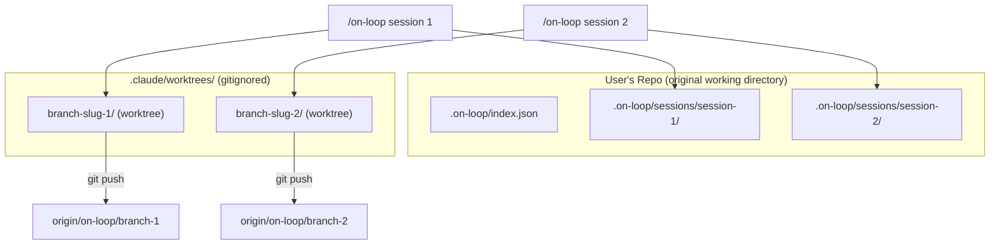
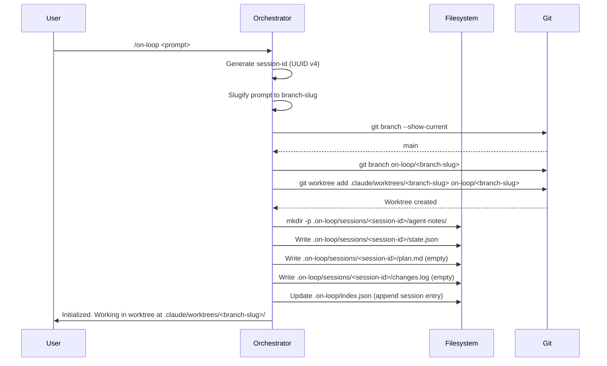
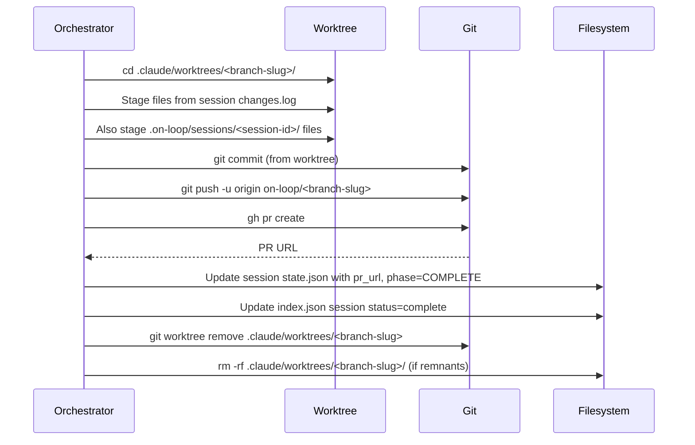

# Architect Notes

## Summary

Specification for three related changes to on-loop v0.3.0: (1) git worktree isolation so multiple on-loop sessions can run concurrently against the same repo, (2) persistent session logs that survive loop completion and are committed to the repo, and (3) version bump from 0.2.0 to 0.3.0 in plugin.json and marketplace.json.

## Decisions

- Worktree path `.claude/worktrees/<branch-slug>/` is already gitignored, so no .gitignore change needed for worktrees
- Session directories live under `.on-loop/sessions/<session-id>/` and are committed to the repo (removing `.on-loop/` from .gitignore)
- Top-level `.on-loop/index.json` tracks all sessions for quick lookup
- state.json schema bumps from version "1.0" to "1.1" to include worktree and session fields
- The hook in hooks.json must be updated to reference session-scoped paths

## Files Modified

- This file (`agent-notes/architect.md`) -- specification document

## Issues Found

- None at specification phase

## Recommendations for Next Agent

- Coding agent should start with the state.json schema changes and workspace initialization logic, then update all command files that reference `.on-loop/` paths
- The hooks.json change-tracker hook needs updating to write to the session-scoped changes.log
- Test that worktree creation/cleanup works correctly on both macOS and Linux

---

# Specification: Git Worktree Sessions with Persistent Logs

## Summary

Currently, `/on-loop` creates a branch in-place, preventing concurrent sessions. This spec adds git worktree isolation so each on-loop run operates in an independent working directory at `.claude/worktrees/<branch-slug>/`. Additionally, the ephemeral `.on-loop/` workspace becomes persistent: each session writes to `.on-loop/sessions/<session-id>/`, which is committed to the repo as a historical log. The plugin version bumps from 0.2.0 to 0.3.0.

## Requirements

### Functional Requirements

1. **FR-001** During INIT, if the orchestrator creates a new branch, it must also create a git worktree at `.claude/worktrees/<branch-slug>/` linked to that branch, and all subsequent agent work must execute within that worktree directory.
2. **FR-002** If the user is already on a feature branch (not main/master), the orchestrator must still create a worktree for that branch at `.claude/worktrees/<branch-slug>/` so the original working directory remains undisturbed.
3. **FR-003** During the GIT phase, commits and pushes must be executed from within the worktree directory.
4. **FR-004** During COMPLETE, after the PR is created, the worktree must be removed via `git worktree remove` and the worktree directory cleaned up.
5. **FR-005** Each `/on-loop` invocation must generate a unique session ID (UUID v4) and create a session directory at `.on-loop/sessions/<session-id>/` containing: `state.json`, `plan.md`, `changes.log`, and `agent-notes/`.
6. **FR-006** The top-level `.on-loop/index.json` must track all sessions with their ID, prompt summary, branch, status, and timestamps.
7. **FR-007** Remove `.on-loop/` from the on-loop plugin's own `.gitignore`. The INIT phase must also stop adding `.on-loop/` to target project `.gitignore` files.
8. **FR-008** The session directory must persist after loop completion. It is committed as part of the GIT phase alongside the feature work.
9. **FR-009** Bump `version` in `.claude-plugin/plugin.json` from `"0.2.0"` to `"0.3.0"`.
10. **FR-010** Bump `version` in `.claude-plugin/marketplace.json` from `"0.2.0"` to `"0.3.0"`.
11. **FR-011** The `/on-loop-status` command must work with the new session-scoped paths, reading from `.on-loop/sessions/<session-id>/state.json`.
12. **FR-012** The `/on-loop-resume` command must accept an optional `--session=<id>` argument or auto-detect the most recent non-complete session from `index.json`.
13. **FR-013** The `/on-loop:clear` command must remove all worktrees associated with on-loop branches, then optionally clean session logs (with user confirmation).
14. **FR-014** The `/on-continue` command must create worktrees for its step-level execution, using the same `.claude/worktrees/` path convention.
15. **FR-015** The `on-loop-change-tracker` hook must resolve the active session directory and write to the session-scoped `changes.log`.

### Non-Functional Requirements

1. **NFR-001** Performance: Worktree creation must complete in under 5 seconds for repos up to 1GB.
2. **NFR-002** Reliability: If worktree creation fails (e.g., branch already has a worktree), the orchestrator must report a clear error and suggest remediation (e.g., `git worktree remove`).
3. **NFR-003** Reliability: If the process is interrupted mid-loop, stale worktrees must be detectable and cleanable via `/on-loop:clear`.
4. **NFR-004** Storage: Session logs should be compact. Agent notes and plan.md are text files; total session directory size should not exceed 100KB for a typical run.
5. **NFR-005** Concurrency: Two simultaneous `/on-loop` invocations on the same repo must not interfere with each other. Each gets its own worktree and session directory.
6. **NFR-006** Compatibility: All git worktree operations must work with git 2.20+ (widely available on macOS and Linux).

## Architecture

### System Design



### Data Flow: INIT Phase (Updated)



### Data Flow: GIT + COMPLETE Phases (Updated)



## Detailed Design

### state.json Schema v1.1

```json
{
  "version": "1.1",
  "loop_id": "<uuid>",
  "session_id": "<uuid>",
  "prompt": "<user prompt>",
  "phase": "INIT",
  "started_at": "<ISO 8601>",
  "updated_at": "<ISO 8601>",
  "branch": "<branch name>",
  "worktree_path": ".claude/worktrees/<branch-slug>",
  "session_dir": ".on-loop/sessions/<session-id>",
  "pr_url": null,
  "retries": {
    "test_to_code": 0,
    "security_to_code": 0,
    "review_to_code": 0
  },
  "max_retries": {
    "test_to_code": 3,
    "security_to_code": 2,
    "review_to_code": 2
  },
  "phases_completed": [],
  "current_agent": "orchestrator",
  "error": null,
  "todos": []
}
```

New fields: `session_id`, `worktree_path`, `session_dir`. Version bumped to `"1.1"`.

### index.json Schema

```json
{
  "version": "1.0",
  "sessions": [
    {
      "session_id": "<uuid>",
      "loop_id": "<uuid>",
      "prompt": "<first 100 chars of prompt>",
      "branch": "<branch name>",
      "status": "active | complete | failed",
      "started_at": "<ISO 8601>",
      "completed_at": "<ISO 8601 or null>",
      "worktree_path": ".claude/worktrees/<branch-slug>",
      "pr_url": null
    }
  ]
}
```

### Session Directory Structure

```
.on-loop/
  index.json
  sessions/
    <session-id-1>/
      state.json
      plan.md
      changes.log
      agent-notes/
        architect.md
        coding.md
        testing.md
        security.md
        documentation.md
        build.md
        reviewer.md
    <session-id-2>/
      ...
```

### Worktree Lifecycle

| Phase | Worktree Action |
|-------|----------------|
| INIT | `git worktree add .claude/worktrees/<slug> <branch>` |
| SPEC through REVIEW | All file reads/writes happen in the worktree. Agent tool dispatches must set cwd to worktree path. |
| GIT | `git add`, `git commit`, `git push` all run from worktree cwd |
| COMPLETE | `git worktree remove .claude/worktrees/<slug>` |
| FAILED | Worktree left in place for `/on-loop-resume`. Cleaned by `/on-loop:clear`. |

### Key Implementation Detail: Agent Working Directory

When dispatching agents via the Agent tool, the orchestrator must ensure the agent operates within the worktree directory. This means:

1. All file paths in `plan.md` are relative to the worktree root
2. The `changes.log` records paths relative to the worktree root
3. The session directory (`.on-loop/sessions/<id>/`) is in the **original repo root**, not the worktree, because it needs to be committed from the main working directory or the worktree (since worktrees share the same git object store)
4. Bash commands issued by agents must `cd` to the worktree path before executing

### Hook Updates

The `on-loop-change-tracker` hook needs to:

1. Detect the active session by reading `.on-loop/index.json` for sessions with `status: "active"`
2. Write to `.on-loop/sessions/<session-id>/changes.log` instead of `.on-loop/changes.log`

The `on-loop-active-reminder` hook needs to:

1. Check `.on-loop/index.json` for any active sessions instead of checking `.on-loop/state.json`

### Files to Modify

| File | Change |
|------|--------|
| `commands/on-loop.md` | Update INIT to create worktree; update all `.on-loop/` references to session-scoped paths; remove .gitignore addition of `.on-loop/`; update GIT phase to work from worktree; update COMPLETE to remove worktree |
| `agents/orchestrator.md` | Update workspace init section, add worktree lifecycle, update all path references to session-scoped, add session tracking via index.json |
| `shared/COMMUNICATION_PROTOCOL.md` | Update workspace structure documentation to reflect sessions layout; remove "ephemeral" language |
| `skills/loop-state/SKILL.md` | Update state.json schema to v1.1 with new fields |
| `commands/on-loop-clear.md` | Add worktree cleanup; update to handle session directories; add `--keep-logs` flag option |
| `commands/on-loop-resume.md` | Add `--session=<id>` argument; update to read from session-scoped state.json |
| `commands/on-loop-status.md` | Update to list all sessions from index.json; show active worktrees |
| `commands/on-continue.md` | Update ephemeral workspace setup to use sessions and worktrees |
| `hooks/hooks.json` | Update both hooks to use session-scoped paths |
| `.gitignore` | Remove `.on-loop/` line |
| `.claude-plugin/plugin.json` | Bump version to 0.3.0 |
| `.claude-plugin/marketplace.json` | Bump version to 0.3.0 |
| `CLAUDE.md` | Update workspace convention section to describe sessions and worktrees |

## Security Considerations

- **Worktree path traversal**: The branch slug used for the worktree directory name must be sanitized to prevent path traversal. Only allow `[a-z0-9-]` characters. Mitigation: slugify function strips all non-alphanumeric characters except hyphens.
- **Session ID predictability**: Session IDs are UUID v4 (cryptographically random), so session directory names are not guessable. Low risk since these are local filesystem paths, but good hygiene.
- **Stale worktree accumulation**: If the process crashes, worktrees are left behind consuming disk space. Mitigation: `/on-loop:clear` cleans them up; the active-reminder hook warns about stale sessions.
- **Sensitive data in session logs**: Agent notes may contain code snippets, security findings, or error messages. Since session logs are now committed, they become part of the repo history. Mitigation: Document this behavior clearly; the security agent should redact sensitive values from its notes.
- **Git worktree and credentials**: Worktrees share the same `.git` directory and thus the same credentials. No additional credential exposure. No concern.

## Technology Decisions

| Decision | Choice | Rationale |
|----------|--------|-----------|
| Worktree path | `.claude/worktrees/<slug>/` | Already gitignored in this repo; keeps worktrees co-located with Claude config |
| Session storage | `.on-loop/sessions/<uuid>/` | UUIDs prevent collision; session dir committed as audit log |
| Session index | `.on-loop/index.json` | Single file for quick session enumeration without scanning directories |
| State schema version | "1.1" | Backwards-compatible addition of fields; version field enables migration |
| Branch for worktree | Same as current branch logic | No change to branch naming; worktree just provides isolation |

### ADR-001: Git Worktree for Session Isolation

**Status**: Proposed
**Context**: Only one on-loop session can run at a time because the orchestrator checks out a branch in-place, modifying the working directory. Users want to run multiple sessions concurrently, and the `/on-continue` command already assumes concurrent execution.
**Decision**: Use `git worktree add` to create an independent working directory per session at `.claude/worktrees/<branch-slug>/`. Each session operates entirely within its worktree. The worktree is removed on completion.
**Consequences**: Requires git 2.20+ (released 2018, widely available). Worktrees share the git object store, so they are space-efficient. Agents must be aware of the worktree cwd. The original working directory is never modified during a loop run, which is a strict improvement. Stale worktrees from crashed sessions need cleanup support.

### ADR-002: Persistent Session Logs

**Status**: Proposed
**Context**: The `.on-loop/` directory is currently ephemeral and gitignored. This means all agent notes, decisions, and audit trails are lost after each run. For compliance-oriented teams, having a record of what the AI agents did, decided, and found is valuable.
**Decision**: Remove `.on-loop/` from `.gitignore`. Each session gets a subdirectory under `.on-loop/sessions/<uuid>/`. Session directories are committed to the repo as part of the GIT phase. An `index.json` at `.on-loop/` root provides a manifest.
**Consequences**: Repo size grows modestly (est. 50-100KB per session). Session logs become part of git history, providing auditability. The `.on-loop/` directory is no longer cleaned between runs -- it accumulates session history. Users who do not want logs committed can re-add `.on-loop/` to their project's `.gitignore`. The INIT phase no longer forces `.on-loop/` into the target project's `.gitignore`.

### ADR-003: Version Bump to 0.3.0

**Status**: Proposed
**Context**: The worktree and session changes are backwards-incompatible in that the workspace structure and state schema change. This warrants a minor version bump per semver.
**Decision**: Bump from 0.2.0 to 0.3.0 in plugin.json and marketplace.json. State schema version bumps from "1.0" to "1.1".
**Consequences**: Users updating from 0.2.0 will get the new behavior. Old `.on-loop/` directories from 0.2.0 runs are incompatible with the new layout but since they were gitignored and ephemeral, no migration is needed.

## Constraints

- All git operations must remain compatible with git 2.20+ (no features from newer git versions)
- The worktree directory `.claude/worktrees/` must remain gitignored (it already is)
- Session directories must not contain files larger than 1MB (agent notes are text only)
- The orchestrator remains the sole writer of state.json (no change to this invariant)
- The hook system must continue to work with the new paths (hooks.json is the only hook config mechanism)

## Out of Scope

- Automatic cleanup of old session logs (can be added later as `/on-loop:prune`)
- Migration tooling for v1.0 state.json to v1.1 (old state was ephemeral, no migration needed)
- Remote worktree support (worktrees are always local)
- Parallel agent execution within a single session (DOC+BUILD parallelism already exists and is unchanged)
- Changes to the roadmap system (`/on-prepare`, `/on-plan`) beyond what `/on-continue` needs
- UI/dashboard for session history browsing

## Open Questions

- **Q1**: Should the session directory also be created inside the worktree for agent access convenience? -- Suggested answer: No. Keep session state in the original repo root. The worktree is for feature code only. Agents read session state from the original root path.
- **Q2**: Should `/on-loop:clear` delete session logs by default or require `--include-logs`? -- Suggested answer: Default behavior should NOT delete session logs. Add `--include-logs` flag to opt into deletion. The worktrees are always cleaned.
- **Q3**: Should the `on-loop-active-reminder` hook list all active sessions or just indicate that active sessions exist? -- Suggested answer: List session IDs and their phases for actionability. Keep it concise (one line per session).
