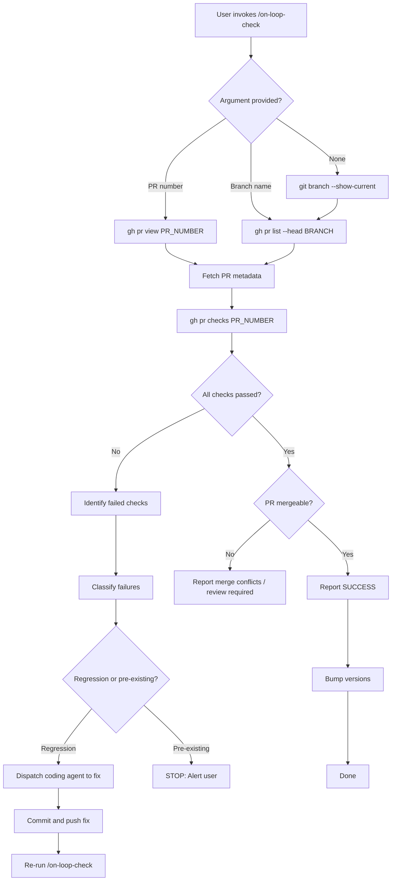
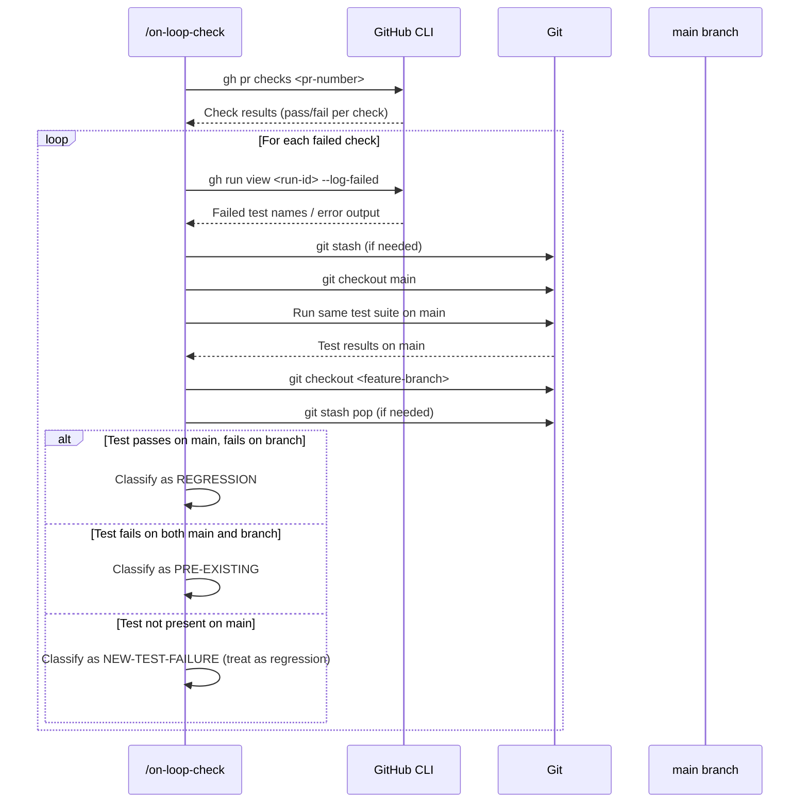

# Architect Agent Notes

## Summary

Specification for `/on-loop-check`, a new slash command that inspects GitHub CI status for a PR, classifies failures as regressions vs pre-existing breakage, auto-fixes regressions via the coding agent, and bumps the plugin version from 0.3.0 to 0.4.0.

## Decisions

- Command follows the existing frontmatter + markdown instruction pattern used by all other `commands/*.md` files
- Regression detection uses `git log` diff comparison against the main branch rather than GitHub API annotations, because the `gh` CLI provides check status but not per-test history
- Version bump is a semver minor bump (0.3.0 -> 0.4.0) since this adds a new user-facing command
- The command does NOT create its own on-loop session; it operates as a lightweight utility command like `/on-loop-status` and `/on-loop:clear`

---

# Specification: /on-loop-check Command

## Summary

`/on-loop-check` is a new user-invocable slash command for the on-loop plugin. It checks whether a GitHub PR's CI pipeline has passed and whether the PR is mergeable. When CI has failed, it distinguishes between regressions introduced by the PR branch and pre-existing failures on main, then either auto-fixes regressions or alerts the user about pre-existing problems. On success, it bumps plugin and marketplace versions.

## Requirements

### Functional Requirements

1. **FR-001** Accept a PR number, branch name, or no argument (auto-detect from current branch) as input
2. **FR-002** Query GitHub CI check status using `gh pr checks` and `gh pr view`
3. **FR-003** Report a clear success message when all checks pass and the PR is mergeable
4. **FR-004** When checks fail, determine whether each failure is a regression or a pre-existing failure on main
5. **FR-005** For regressions: automatically dispatch the coding agent to fix the failing tests, then re-push
6. **FR-006** For pre-existing failures: STOP and alert the user with the failing check names, links, and instructions
7. **FR-007** Bump `version` in `.claude-plugin/plugin.json` from `0.3.0` to `0.4.0`
8. **FR-008** Bump `version` in `.claude-plugin/marketplace.json` (plugins array entry) from `0.3.0` to `0.4.0`
9. **FR-009** Register the command in `CLAUDE.md` under the Commands section

### Non-Functional Requirements

1. **NFR-001** Execution: The command must complete the check phase (excluding remediation) in under 30 seconds on a typical GitHub-hosted repo
2. **NFR-002** Idempotency: Running the command multiple times must not create duplicate version bumps or duplicate commits
3. **NFR-003** Error resilience: If `gh` CLI is not installed or not authenticated, report a clear error with setup instructions
4. **NFR-004** Offline safety: If GitHub API is unreachable, fail gracefully with a retry suggestion

## Architecture

### System Design



### Failure Classification Flow



### API Design

This is a CLI command, not an HTTP API. The interface is:

```
/on-loop-check                          # Auto-detect from current branch
/on-loop-check 42                       # PR number
/on-loop-check on-loop/my-feature       # Branch name
```

**Output format** (success):
```
On-Loop Check
=============
PR:          #42 — Add user management API
Branch:      on-loop/user-management-api
Status:      ALL CHECKS PASSED
Mergeable:   Yes

Checks:
  [PASS] ci/tests          — 2m 14s
  [PASS] ci/lint           — 0m 32s
  [PASS] ci/security-scan  — 1m 05s

Version bumped: 0.3.0 -> 0.4.0
  .claude-plugin/plugin.json
  .claude-plugin/marketplace.json
```

**Output format** (regression detected):
```
On-Loop Check
=============
PR:          #42 — Add user management API
Branch:      on-loop/user-management-api
Status:      FAILED — 1 regression detected

Checks:
  [PASS] ci/lint           — 0m 32s
  [FAIL] ci/tests          — REGRESSION — fixing automatically...
  [PASS] ci/security-scan  — 1m 05s

Dispatching coding agent to fix regression...
```

**Output format** (pre-existing failure):
```
On-Loop Check
=============
PR:          #42 — Add user management API
Branch:      on-loop/user-management-api
Status:      BLOCKED — pre-existing failure on main

Checks:
  [PASS] ci/lint           — 0m 32s
  [FAIL] ci/tests          — PRE-EXISTING (also fails on main)
  [PASS] ci/security-scan  — 1m 05s

ACTION REQUIRED:
  The following checks fail on main and are NOT caused by this PR:
    - ci/tests: https://github.com/owner/repo/actions/runs/12345

  Options:
    1. Fix the failing test on main first, then rebase this branch
    2. Add the failing test to a known-failures list and re-run
    3. Contact the team to investigate the main branch failure

  This command will NOT attempt to fix pre-existing failures.
```

## Command File Structure

### Frontmatter

```yaml
---
name: on-loop-check
description: Check GitHub CI status for a PR, fix regressions, alert on pre-existing failures
user_invocable: true
argument: "[PR number or branch name]"
---
```

### File Location

`commands/on-loop-check.md`

## Detailed Algorithm

### Step 1: Resolve PR

```bash
# If argument is a number:
gh pr view <number> --json number,title,headRefName,mergeable,state

# If argument is a branch name:
gh pr list --head <branch> --json number,title,headRefName,mergeable,state --limit 1

# If no argument:
BRANCH=$(git branch --show-current)
gh pr list --head $BRANCH --json number,title,headRefName,mergeable,state --limit 1
```

If no PR is found, report an error suggesting the user create a PR first or provide the correct argument.

### Step 2: Check CI Status

```bash
gh pr checks <pr-number>
```

Parse the output to get status (pass/fail/pending) for each check.

If any checks are **pending**, report that checks are still running and suggest waiting. Do not proceed with classification.

### Step 3: Classify Failures

For each failed check:

1. Get the failed run details:
   ```bash
   gh run view <run-id> --json jobs
   gh run view <run-id> --log-failed
   ```

2. Determine if the same check fails on main:
   ```bash
   # Get the latest completed run for main
   gh run list --branch main --workflow <workflow-name> --status completed --limit 1 --json databaseId,conclusion
   ```

3. Classification rules:
   - If the same workflow **passes** on the latest main run: **REGRESSION**
   - If the same workflow **fails** on the latest main run: **PRE-EXISTING**
   - If the workflow **does not exist** on main (new workflow): treat as **REGRESSION** (the PR introduced it, so the PR should fix it)
   - If main has no completed runs for this workflow: treat as **REGRESSION** (cannot prove pre-existing)

### Step 4a: Fix Regressions

When regressions are detected:

1. Find the on-loop session for this branch by reading `.on-loop/index.json` and matching on `branch`
2. If a session exists:
   - Read the session's `state.json`, `plan.md`, and agent notes
   - Extract the failed test output from `gh run view --log-failed`
   - Dispatch the coding agent with remediation context:
     - The failed test output
     - Instructions to fix only the regression (do not modify unrelated code)
     - The session directory for writing agent notes and changes.log
   - After the coding agent completes, commit and push the fix
   - Report to the user that a fix has been pushed and CI will re-run
3. If no session exists:
   - Report the regression details
   - Suggest the user fix manually or run `/on-loop-resume` if applicable
   - Provide the failed test output for context

### Step 4b: Alert on Pre-Existing Failures

When pre-existing failures are detected:

1. List each failing check with:
   - Check name
   - Link to the failed run on GitHub
   - Link to the same failing run on main (proof it is pre-existing)
2. Provide actionable instructions (fix main first, add to known-failures, contact team)
3. Do NOT attempt any automatic fix
4. Exit with a clear "BLOCKED" status

### Step 5: Version Bump

Only performed when all checks pass and the PR is mergeable (Step 3 success path).

1. Read `.claude-plugin/plugin.json`
2. Replace `"version": "0.3.0"` with `"version": "0.4.0"`
3. Read `.claude-plugin/marketplace.json`
4. Replace `"version": "0.3.0"` with `"version": "0.4.0"`
5. Stage and commit:
   ```bash
   git add .claude-plugin/plugin.json .claude-plugin/marketplace.json
   git commit -m "Bump plugin version to 0.4.0

   Co-Authored-By: Claude Opus 4.6 <noreply@anthropic.com>"
   ```
6. Push: `git push`

**Idempotency**: Before bumping, check if the version is already `0.4.0`. If so, skip the bump and report that the version is already current.

### Step 6: Mixed Failures

When both regressions AND pre-existing failures exist in the same PR:

1. Report both categories clearly
2. Attempt to fix the regressions (dispatch coding agent)
3. Alert the user about the pre-existing failures
4. Do NOT bump versions (the PR is not fully passing)

## Security Considerations

- **gh CLI authentication**: The command relies on `gh auth status` being valid. If not authenticated, report a clear error with `gh auth login` instructions. Never store or log tokens.
- **Branch injection**: Validate branch name input against `^[a-zA-Z0-9._/-]+$` to prevent command injection in shell commands.
- **Log output**: Failed test logs from `gh run view --log-failed` may contain secrets leaked in CI. Do not persist these logs to files; only display them in the terminal output and pass relevant excerpts to the coding agent.
- **Version file writes**: Only modify the two specific JSON files. Validate that the files exist and contain expected structure before writing.

## Technology Decisions

| Decision | Choice | Rationale |
|----------|--------|-----------|
| CI status tool | `gh` CLI | Already required by the on-loop GIT phase; consistent with existing tooling |
| Regression detection | Compare workflow conclusions between PR branch and main | Simple, reliable, does not require per-test parsing which varies by CI provider |
| Version bump scope | Minor bump (0.3.0 -> 0.4.0) | Adding a new user-facing command constitutes a minor version increment per semver |
| Command style | Standalone utility (no on-loop session required) | Like `/on-loop-status` and `/on-loop:clear`, this is a lightweight check, not a full SDLC loop |
| Coding agent dispatch | Reuse existing session if available | Preserves context from the original implementation for better remediation |

### ADR-001: Regression Detection via Workflow Conclusion Comparison

**Status**: Proposed
**Context**: We need to determine whether a CI failure was introduced by the PR (regression) or already exists on main (pre-existing). Options considered: (a) compare per-test results using CI provider APIs, (b) compare workflow-level conclusions between branches, (c) run tests locally on both branches.
**Decision**: Compare workflow-level conclusions using `gh run list --branch main` to check if the same workflow also fails on main. This is workflow-granularity, not test-granularity.
**Consequences**: Simple and provider-agnostic (works with any GitHub Actions workflow). Trade-off: if a workflow has 100 tests and 1 pre-existing failure + 1 new regression, the entire workflow will be classified as pre-existing (false negative on the regression). Mitigation: when a workflow fails on both branches, parse `--log-failed` output and compare specific failure messages to refine the classification.

### ADR-002: No Dedicated On-Loop Session for /on-loop-check

**Status**: Proposed
**Context**: Should `/on-loop-check` create its own session (like `/on-loop`) or operate statelessly (like `/on-loop-status`)?
**Decision**: Operate statelessly. The command reads existing sessions if available (for coding agent context) but does not create its own session directory.
**Consequences**: Simpler execution model. The coding agent dispatch for regression fixes reuses the existing session. If no session exists, the command still works but with limited auto-fix capability (reports the regression instead of fixing it).

### ADR-003: Version Bump Placement

**Status**: Proposed
**Context**: Should the version bump happen as part of this command or be deferred to the coding agent / build agent?
**Decision**: The command itself performs the version bump directly after confirming all checks pass. This is a simple JSON edit, not a code change.
**Consequences**: Version bump is tightly coupled to the check-passing event, ensuring versions only bump on green CI. The bump commit is separate from feature code, making it easy to identify in git history.

## Constraints

- Requires `gh` CLI installed and authenticated (`gh auth status` must succeed)
- Requires an existing PR on GitHub (the command checks remote CI, not local test runs)
- Regression auto-fix only works when an on-loop session exists for the branch (otherwise, manual fix instructions are provided)
- The command must be run from within the repository (needs git context)
- Version bump targets specific version strings; if the version has already been bumped by another process, the command detects this and skips

## Out of Scope

- Running tests locally (this command checks remote CI only)
- Fixing pre-existing failures on main
- Creating PRs (that is `/on-loop`'s GIT phase responsibility)
- Handling non-GitHub CI providers (Jenkins, CircleCI, GitLab CI)
- Automatic merge after checks pass (user decides when to merge)
- Monitoring CI in real-time / waiting for pending checks to complete

## Open Questions

- **Q1**: Should the version bump commit be pushed automatically, or should the user confirm first? -- Suggested answer: Push automatically since the user explicitly invoked the command and all checks passed. The commit message clearly identifies it as a version bump.
- **Q2**: If regression auto-fix fails (coding agent cannot resolve the issue), should the command retry? -- Suggested answer: No. Report the failure and suggest the user fix manually or run `/on-loop-resume --from=CODE`. One auto-fix attempt is sufficient to avoid infinite loops.
- **Q3**: Should the command support `--dry-run` to show what it would do without making changes? -- Suggested answer: Not in v1. Add if users request it. The check-only behavior (before version bump) is inherently read-only.

## Files to Create/Modify

| File | Action | Description |
|------|--------|-------------|
| `commands/on-loop-check.md` | CREATE | New slash command file with frontmatter and full instructions |
| `.claude-plugin/plugin.json` | MODIFY | Bump version from 0.3.0 to 0.4.0 |
| `.claude-plugin/marketplace.json` | MODIFY | Bump version from 0.3.0 to 0.4.0 |
| `CLAUDE.md` | MODIFY | Add `/on-loop-check` to the Commands section |

## Recommendations for Next Agent

- The coding agent should create `commands/on-loop-check.md` following the exact frontmatter pattern from existing commands (see `on-loop-status.md` for a close analog)
- The command instructions should be thorough but not overly prescriptive about exact shell output formatting -- the executing LLM can adapt
- Ensure the `gh` CLI prerequisite check is the very first step in the command instructions
- The version bump logic should read-then-write (not blind replace) to handle idempotency
- CLAUDE.md update should add the command in alphabetical order within the Commands section
