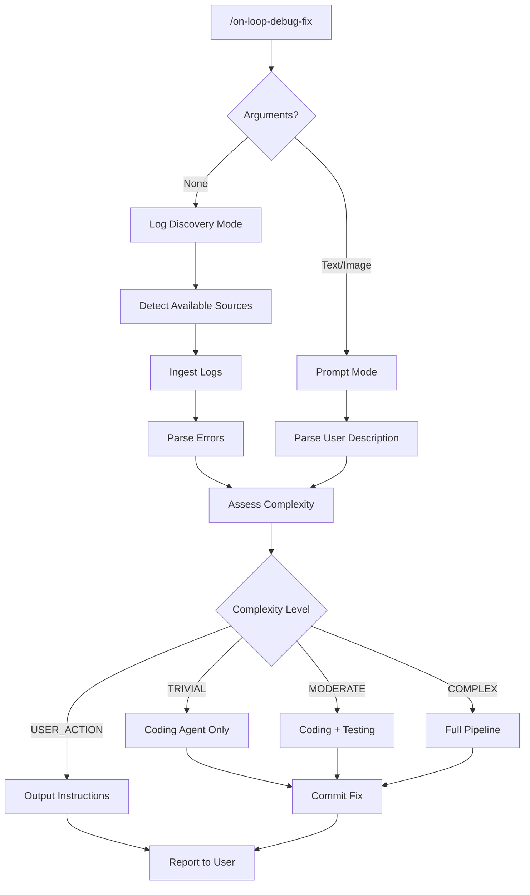
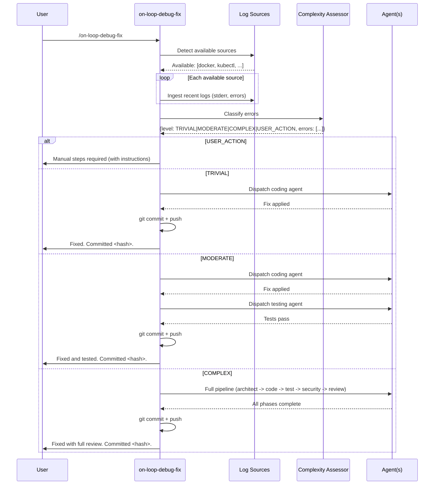
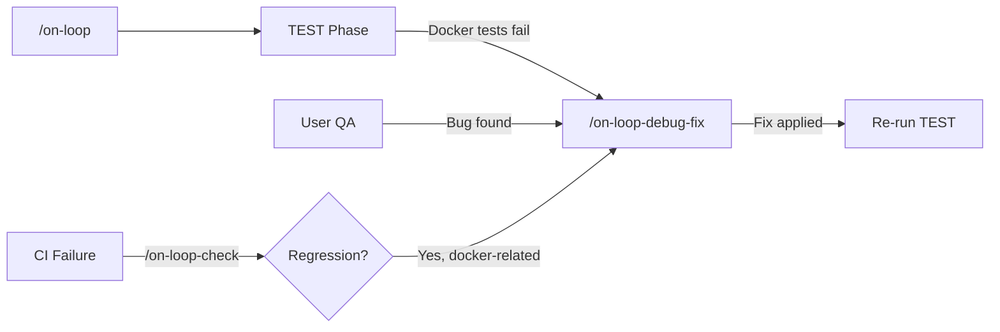

# Architect Notes

## Summary

Specification for `/on-loop-debug-fix`, a dual-mode debugging command that ingests logs from infrastructure sources or accepts user-provided bug descriptions (with optional screenshots), assesses bug complexity, and scales orchestration from a single coding-agent fix up to a full pipeline. The command operates in the current worktree, resolves `.env` files from the main repo root, and optimizes docker workflows for fast debug-fix-test cycles.

## Decisions

- The command uses a three-tier complexity model (TRIVIAL / MODERATE / COMPLEX) to avoid over-orchestrating simple fixes
- Log ingestion auto-detects available sources rather than requiring explicit configuration
- `.env` resolution uses `--env-file` pointing to the repo root rather than symlinks or copies (avoids stale copies and dangling symlinks)
- Docker optimization guidance is written into the command instructions as advisory recommendations rather than automated rewrites
- The command does NOT create a new worktree or session; it reuses the current working context
- Version bump: 0.4.0 to 0.5.0

## Files to Create

- `commands/on-loop-debug-fix.md` -- the slash command definition

## Files to Modify

- `.claude-plugin/plugin.json` -- version bump to 0.5.0
- `.claude-plugin/marketplace.json` -- version bump to 0.5.0
- `CLAUDE.md` -- add `/on-loop-debug-fix` to command list

## Issues Found

- None at spec phase

## Recommendations for Next Agent

- The command file is self-contained markdown following the pattern of `on-loop-check.md`
- The complexity assessment logic is procedural (step-by-step in the command instructions), not code -- it runs as Claude reasoning within the command execution
- Focus implementation on getting the command file structure right; the "code" is the markdown instruction set

---

# Specification: /on-loop-debug-fix

## Summary

`/on-loop-debug-fix` is a dual-mode debugging command for the on-loop plugin. In log-discovery mode (no arguments), it ingests logs from available infrastructure sources (docker compose, kubectl, MCP servers, Thanos, Loki), parses errors, identifies root causes, and fixes them. In prompt mode (user provides text and optionally an image), it uses the user's bug description as debugging context. The command assesses bug complexity before deciding how many agents to involve, ensuring trivial fixes complete in seconds rather than minutes.

## Requirements

### Functional Requirements

1. **FR-001** Dual-mode invocation: no-argument triggers log-discovery mode; text/image argument triggers prompt mode.
2. **FR-002** Log-discovery mode auto-detects which infrastructure sources are available (docker compose, kubectl, MCP, Thanos, Loki) and ingests from all available sources.
3. **FR-003** Prompt mode accepts a text description and an optional image (screenshot) as debugging context.
4. **FR-004** Complexity assessment classifies bugs into TRIVIAL, MODERATE, or COMPLEX before dispatching agents.
5. **FR-005** TRIVIAL bugs (typos, wrong field names, config errors) dispatch only the coding agent, fix, and commit.
6. **FR-006** MODERATE bugs (logic errors, missing error handling) dispatch coding + testing agents.
7. **FR-007** COMPLEX bugs (architectural issues, security flaws, multi-service failures) dispatch the full pipeline (architect, coding, testing, security, reviewer).
8. **FR-008** Detect user-action-required situations (missing API keys, external service configuration) and output clear instructions instead of attempting code fixes.
9. **FR-009** Resolve `.env` files from the main repository root when running docker compose from a worktree.
10. **FR-010** Provide docker optimization recommendations (smaller images, layer caching, hot-reload strategies) when docker-related issues are detected.
11. **FR-011** Integrate with existing on-loop sessions -- reuse the active session if one exists for the current branch.
12. **FR-012** Operate in the current worktree without creating a new one.
13. **FR-013** Commit fixes with descriptive messages including the `Co-Authored-By` trailer.

### Non-Functional Requirements

1. **NFR-001** Performance: TRIVIAL fixes complete in under 60 seconds (single agent dispatch, no pipeline overhead).
2. **NFR-002** Security: Log ingestion must not persist raw logs to files (logs may contain secrets). Process in-memory only.
3. **NFR-003** Security: `.env` resolution must never copy `.env` into the worktree (risk of committing secrets).
4. **NFR-004** Reliability: If log source detection fails for one source, continue with remaining sources.
5. **NFR-005** Usability: User-action-required items are clearly separated from automated fixes in the output.

## Architecture

### System Design



### Data Flow: Log Discovery Mode



### Complexity Assessment Algorithm

The complexity classifier examines:

| Signal | Points | Example |
|--------|--------|---------|
| Single file affected | 0 | Typo in one config file |
| Multiple files affected | +2 | Bug spans 3 source files |
| Error is in test output only | 0 | Test assertion wrong |
| Error is a runtime crash/panic | +2 | Null pointer, unhandled exception |
| Error involves authentication/authorization | +3 | Auth token rejected |
| Error involves data corruption or loss | +4 | Database write fails silently |
| Error spans multiple services | +3 | Service A cannot reach Service B |
| Error is a configuration/environment issue | -1 (USER_ACTION flag) | Missing API key |
| Error is a simple name mismatch | -2 | Field called `user_name` vs `username` |
| Error message contains security keywords | +3 | "unauthorized", "forbidden", "injection" |

**Scoring:**
- **USER_ACTION** (any negative score with USER_ACTION flag): Output instructions, no code fix
- **TRIVIAL** (0-2 points): Coding agent only
- **MODERATE** (3-5 points): Coding + testing agents
- **COMPLEX** (6+ points): Full pipeline

### Log Source Detection and Ingestion

```markdown
For each source, test availability and ingest:

1. **Docker Compose**
   - Detect: `docker compose ps 2>/dev/null` (exit code 0 = available)
   - Ingest: `docker compose logs --tail=200 --no-log-prefix 2>&1 | grep -iE "error|fatal|panic|exception|fail|traceback"`
   - .env handling: `docker compose --env-file <repo-root>/.env logs ...`

2. **Kubectl**
   - Detect: `kubectl cluster-info 2>/dev/null` (exit code 0 = available)
   - Ingest: `kubectl logs --all-containers --since=10m -l app=<detected-app> 2>&1 | grep -iE "error|fatal|panic|exception|fail|traceback"`
   - Pod detection: `kubectl get pods --no-headers -o custom-columns=":metadata.name,:status.phase" | grep -v Running`

3. **MCP Servers**
   - Detect: Check if MCP tools are available in the current Claude session
   - Ingest: Use available MCP log-retrieval tools

4. **Thanos**
   - Detect: Check for Thanos endpoint in environment or config
   - Ingest: Query for error-rate metrics, alert firing status
   - Example: `up == 0` or `rate(http_requests_total{code=~"5.."}[5m]) > 0`

5. **Loki**
   - Detect: Check for Loki endpoint in environment or config
   - Ingest: LogQL query for errors: `{job=~".+"} |= "error" | level="error"`
```

### .env Resolution Algorithm

```
1. Determine repo root:
   - Run: git rev-parse --show-toplevel
   - This is the MAIN repo root (not the worktree)
   
2. Determine current directory context:
   - If cwd is under .claude/worktrees/<slug>/, we are in a worktree
   - The .env file is at <repo-root>/.env
   
3. For docker compose commands:
   - ALWAYS pass: docker compose --env-file <repo-root>/.env <subcommand>
   - This works regardless of cwd
   
4. For other tools needing .env:
   - Export variables: set -a; source <repo-root>/.env; set +a
   - Then run the tool
   
5. NEVER copy or symlink .env into the worktree
   - Risk: .env gets committed (even with .gitignore, accidents happen)
   - Risk: Symlinks break if repo root moves
   - Risk: Copied .env goes stale
```

### User Action Detection

The command identifies situations requiring manual user intervention:

| Pattern | Detection | User Instruction |
|---------|-----------|-----------------|
| Missing API key | Error contains "API key", "api_key", "APIKEY" + "missing", "not set", "undefined" | "Set <KEY_NAME> in your .env file at <repo-root>/.env" |
| Missing service credentials | Error contains "authentication failed", "invalid credentials" for external services | "Configure credentials for <SERVICE> -- see <SERVICE> docs" |
| Port conflict | Error contains "address already in use", "EADDRINUSE" | "Port <N> is in use. Stop the conflicting process or change the port in config" |
| Disk/memory limits | Error contains "no space left", "out of memory", "OOMKilled" | "Increase Docker resource limits or free disk space" |
| Network/DNS issues | Error contains "could not resolve host", "connection refused" to external hosts | "Check network connectivity to <HOST>" |
| Missing external dependency | Error contains "command not found", "not installed" for system tools | "Install <TOOL>: <install-command>" |

### Docker Optimization Recommendations

When docker-related issues are detected, the command provides advisory recommendations:

1. **Multi-stage builds**: If Dockerfile uses a single stage with build tools in the final image, recommend multi-stage.
2. **Layer caching**: If COPY precedes dependency install, recommend reordering (COPY package files first, install, then COPY source).
3. **Hot-reload strategies**:
   - BEAM/Erlang/Elixir: Use hot code loading (`mix phx.server` with `--open` in dev)
   - Python/Node/Ruby: Volume-mount source directories, use file-watching tools (nodemon, uvicorn --reload)
   - Go/Rust/Java: Use `docker compose watch` or air/cargo-watch with volume mounts
4. **Image size**: If base image is not `*-slim` or `*-alpine`, recommend switching.
5. **Docker Compose profiles**: Recommend profiles to avoid starting unnecessary services during debugging.
6. **Build cache mounts**: Recommend `--mount=type=cache` for package manager caches.

These recommendations are output as advisory text, not automated changes, because they require developer judgment about trade-offs.

### Integration with On-Loop Pipeline



Integration rules:
- When called from within an on-loop session (active session exists for current branch), reuse that session's `state.json`, `plan.md`, and agent notes for context.
- When called standalone (no active session), operate without session infrastructure -- just fix and commit.
- The command can be invoked by the orchestrator during the TEST phase when `docker compose up` or `docker compose run` failures are detected.

## Security Considerations

- **Log handling**: Logs may contain secrets (API keys, tokens, passwords). NEVER persist raw logs to files. Process in-memory, extract only error messages and stack traces. Redact any string matching common secret patterns (`(?i)(password|secret|token|key|auth)\s*[:=]\s*\S+`).
- **`.env` safety**: The `.env` file must never be copied into, symlinked into, or committed from a worktree. Always use `--env-file` flags or in-process `source` with no file creation.
- **Command injection**: Log content is untrusted. Never interpolate log content into shell commands. Use proper quoting and argument passing.
- **Image/screenshot handling**: User-provided images are passed to Claude's multimodal input. No file system persistence of screenshots beyond the conversation context.

## Technology Decisions

| Decision | Choice | Rationale |
|----------|--------|-----------|
| Command format | Markdown slash command (`.md` file in `commands/`) | Consistent with all existing on-loop commands |
| Complexity assessment | Point-based heuristic in command instructions | No external tooling needed; runs as Claude reasoning; easy to tune |
| .env resolution | `--env-file` flag pointing to repo root | No file duplication, no symlink fragility, works with docker compose natively |
| Log ingestion | Auto-detect with graceful fallback | User should not need to configure which sources exist |
| Docker optimization | Advisory output, not automated | Docker build changes require developer judgment; wrong automation breaks builds |
| Session reuse | Reuse active session if exists, standalone otherwise | Avoids creating orphan sessions for quick fixes |
| Version | 0.5.0 | New user-facing feature (new command) warrants minor version bump |

### ADR-001: Complexity-Gated Orchestration

**Status**: Proposed
**Context**: The full on-loop pipeline (architect, coding, testing, security, review) takes 10-20 minutes. Most debug fixes are trivial (typos, config errors) and should complete in under a minute. Routing every bug through the full pipeline wastes time and tokens.
**Decision**: Implement a three-tier complexity classifier (TRIVIAL/MODERATE/COMPLEX) that examines error signals and routes to the minimal set of agents needed. A fourth category (USER_ACTION) handles issues requiring manual intervention.
**Consequences**: Simple bugs are fixed fast (seconds, not minutes). The trade-off is that the classifier may occasionally misclassify -- a seemingly trivial fix might have deeper implications. Mitigation: the user can always re-run with a prompt providing more context, which biases toward higher complexity. The classifier errs on the side of simplicity; if the fix fails tests, the user can escalate.

### ADR-002: No New Worktree, No New Session

**Status**: Proposed
**Context**: `/on-loop` creates a worktree and session for each invocation. `/on-loop-debug-fix` is called during active development or debugging of an existing feature -- creating a new worktree would be confusing and wasteful.
**Decision**: The command operates in the current working directory (which may be a worktree or the main repo). It reuses the active on-loop session if one exists for the current branch. If no session exists, it operates standalone without session infrastructure.
**Consequences**: Simpler mental model for the user ("fix this bug right here"). The trade-off is reduced audit trail when operating standalone (no session directory to commit). Mitigation: the commit message itself serves as the audit record for standalone fixes.

### ADR-003: .env via --env-file, Never Copy

**Status**: Proposed
**Context**: Docker compose in a worktree cannot find `.env` because it looks in the current directory. Options: (a) symlink `.env` into worktree, (b) copy `.env` into worktree, (c) pass `--env-file` flag.
**Decision**: Always use `docker compose --env-file <repo-root>/.env`. Never copy or symlink.
**Consequences**: Requires every `docker compose` invocation to include the flag. This is slightly more verbose but eliminates the risk of accidentally committing `.env` or having stale copies. The command instructions enforce this pattern for all docker compose calls.

### ADR-004: Log Redaction Before Processing

**Status**: Proposed
**Context**: Infrastructure logs may contain secrets (leaked in error messages, debug output, environment dumps). Processing these logs through agent context risks secret exposure.
**Decision**: Apply regex-based redaction to all ingested logs before passing them to any agent. Redact values matching `(?i)(password|secret|token|key|auth|credential)\s*[:=]\s*\S+` and replace with `[REDACTED]`.
**Consequences**: Some useful debugging context may be lost if legitimate error messages match the redaction pattern. This is an acceptable trade-off for security. Users can provide specific values via prompt mode if redaction is too aggressive.

## Constraints

- The command file must be a single markdown file in `commands/` following the existing frontmatter + instructions pattern
- All agent dispatches must use the same agent definitions in `agents/`
- No new agent definitions are created -- existing agents are reused
- The command must work with or without an active on-loop session
- Docker compose commands must always use `--env-file` when the cwd is a worktree
- Raw logs must never be written to files

## Out of Scope

- Automated Dockerfile rewriting (advisory recommendations only)
- Custom log source plugins (the command supports a fixed set of sources)
- Persistent log storage or log aggregation
- Kubernetes deployment changes (the command reads logs but does not modify k8s resources)
- MCP server configuration (assumes MCP tools are already configured if available)
- Multi-cluster kubectl support (uses current context only)
- Automated `.env` key generation or rotation

## Open Questions

- **Q1**: Should the command support a `--complexity=<level>` override flag to let users force a specific orchestration tier? -- Suggested answer: Yes, add `[--complexity=trivial|moderate|complex]` as an optional argument. This lets users bypass the heuristic when they know the fix scope.
- **Q2**: Should standalone mode (no active session) still write agent notes somewhere? -- Suggested answer: No. Standalone fixes are lightweight; the commit message is sufficient audit trail. Adding session infrastructure to standalone mode defeats the "fast fix" purpose.
- **Q3**: What is the log lookback window for each source? -- Suggested answer: Default to last 10 minutes for kubectl, last 200 lines for docker compose logs, last 5 minutes for Loki/Thanos queries. These are reasonable defaults that capture recent failures without overwhelming context.
