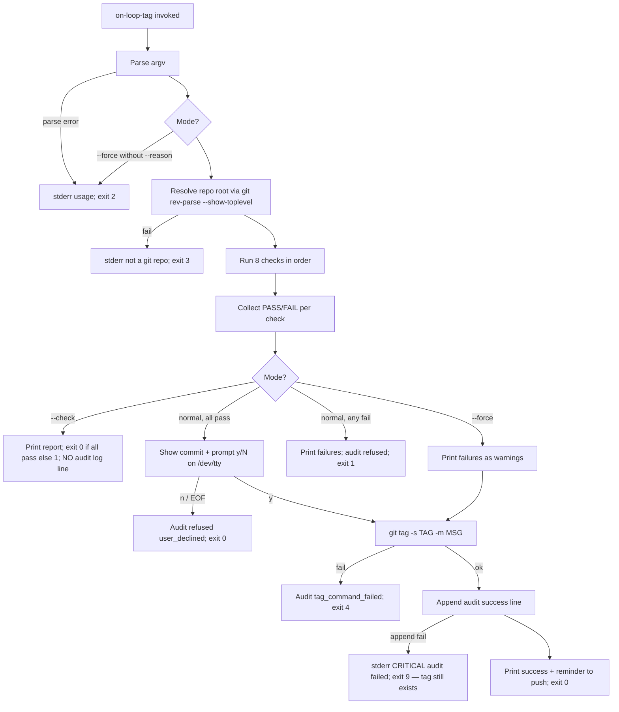
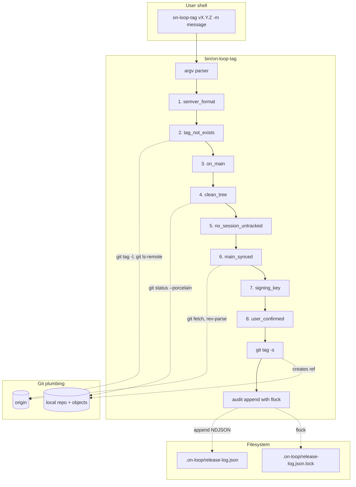

# Architect Notes — on-loop-tag Layer 1

## Summary

Layer 1 of the conservative release-tagging pipeline: a single POSIX-bash script `bin/on-loop-tag` that performs eight verbatim pre-flight checks before invoking `git tag -s`, plus a bats test suite, an audit log on `.on-loop/release-log.json`, an installer step in `setup/fedora-bootstrap.sh`, and user-facing documentation. The design is motivated by the 2026-05-20 v0.2.3 incident in which untracked `.on-loop/sessions/...` files silently aborted `git pull` and caused a signed tag to be created against the previous release's commit; Layer 1 makes that failure mode unreachable under the default workflow and only escapable via an audited, reason-bearing `--force`.

## Decisions

- **D-1 (script language).** POSIX-compatible Bash 4.x+ with `set -euo pipefail` and `IFS=$'\n\t'`. Reason: `git` is already a hard dependency; bash is universally available on Fedora and macOS; no runtime install needed.
- **D-2 (install method).** **Symlink** `~/.local/bin/on-loop-tag` -> `<repo>/bin/on-loop-tag`. Reason: edits to the checkout immediately propagate (matches existing marketplace pattern, see `setup/README.md`). Trade-off documented in section 6.
- **D-3 (CLI parsing).** Manual `while`-loop `case` parser, **not** `getopts`. Reason: we need to support long options (`--check`, `--force`, `--reason`), and `getopts` does not. The script must also accept `-m "<message>"` as a positional-ish short flag that mirrors `git tag -m` semantics.
- **D-4 (atomic audit-log append).** `flock` + write-rename pattern. Reason: NDJSON `>>` is not atomic under concurrent invocations >4 KiB; using `flock -x` on a sidecar `.lock` file plus a single `printf '%s\n'` write guarantees one-line-at-a-time semantics. Falls back to `flock -w 5` (5 s timeout) then errors out.
- **D-5 (exit-code taxonomy).** Distinct, documented exit codes (see section 2.3) so CI and humans can branch precisely.
- **D-6 (no remote tag refusal also covers signed-tag race).** The remote check uses `git ls-remote --tags --refs origin "refs/tags/$TAG"` (note `--refs`) so we ignore peeled tag objects and match only real tag refs.
- **D-7 (confirmation prompt).** Prompt only reads from `/dev/tty` (not stdin). Reason: lets us pipe `echo "n" | on-loop-tag` in tests by allowing an explicit override via `--yes`. We will NOT add `--yes` in Layer 1 to keep the bypass surface minimal; tests instead redirect a here-string to `/dev/tty` via `bats`'s `run` + `<<<` pattern using `expect`-free bash. Trade-off: confirmation cannot be scripted outside `--force`; that is intentional.
- **D-8 (TTY detection).** If stdin is not a TTY and `--force` is not set, refuse with exit code 7 (`E_NO_TTY`). Reason: silent CI pipelines must not accidentally bypass the prompt — they must explicitly `--force --reason`.
- **D-9 (semver regex).** Use `^v[0-9]+\.[0-9]+\.[0-9]+(-[a-zA-Z0-9.]+)?$` exactly as specified in the user prompt; do not extend with build metadata (`+`). Pre-release tags like `v0.2.3-rc1` are allowed.
- **D-10 (force still runs checks).** `--force` runs all 8 checks, reports each FAIL, and proceeds anyway; the audit log records `checks_failed` (note: plural, snake_case) with the token list. Reason: defense in depth — operators see exactly what they're bypassing.

## Files Modified

This phase writes only this notes file. Downstream agents will create:

- `bin/on-loop-tag` (coding) — executable script
- `bin/on-loop-tag.md` (documentation) — usage manual
- `tests/test_on_loop_tag.bats` (testing) — 15 bats cases
- `tests/helpers/git_fixture.bash` (testing) — temp-repo fixture helpers
- `setup/fedora-bootstrap.sh` (coding) — append symlink-install block
- `README.md` (documentation) — new "Safe release tagging" section
- `.on-loop/release-log.json` (runtime, gitignored content) — created lazily on first invocation
- `.github/workflows/on-loop-tag.yml` (build) — runs bats on push/PR (build agent owns; out of scope here)

## Issues Found

None blocking. See section 8 for edge cases the coding agent must implement defensively.

## Recommendations for Next Agent (Coding)

1. Implement checks in the exact order listed in section 3. Order matters: tag-format and tag-not-exists must run first (cheap and most common refusal) before doing `git fetch`.
2. Use the audit-log token names verbatim (table in section 3) — the bats tests assert on them.
3. Do not write to `.on-loop/release-log.json` until at least the format check has passed AND argument parsing succeeded; argv parse errors exit with code 2 and produce no log line (consistent with shell convention).
4. After `git tag -s` succeeds, immediately append the audit log line; if the audit-log append fails, do **not** delete the tag — print a CRITICAL warning to stderr and exit 9. The tag is the source of truth; a missing log line is a SOC2 finding, not a release blocker.

---

# Specification: bin/on-loop-tag (Layer 1)

## Goals & Non-Goals

### Goals (in scope for Layer 1)

1. Provide a single command `on-loop-tag vX.Y.Z -m "<message>"` that creates a signed annotated tag *only* if 8 pre-flight checks pass.
2. Provide `--check` mode that runs all 8 checks and reports without tagging.
3. Provide `--force --reason "<text>"` audited bypass for emergencies.
4. Append a structured NDJSON line to `.on-loop/release-log.json` on every invocation (success, refusal, force-bypass).
5. Install the script to `~/.local/bin/on-loop-tag` via `setup/fedora-bootstrap.sh`.
6. Ship a 15-case bats test suite covering every check and both alternate modes.
7. Ship documentation: `bin/on-loop-tag.md` + a README section.
8. Hand off cleanly to the build agent to wire a GitHub Actions workflow.

### Non-Goals (explicitly out of scope; later layers)

- **GPG/SSH key provisioning automation.** Layer 1 only verifies that `user.signingkey` is configured; it does not create or rotate keys.
- **Release-notes prefill** from `git log` or PRs.
- **Quay/registry image build trigger** — image promotion logic is downstream.
- **Auto-push of the new tag** to `origin`. Layer 1 creates the local tag only; the user explicitly runs `git push origin <tag>` afterwards. This matches the "principle of least surprise" — a signed tag is a permanent artifact; pushing is the user's decision.
- **`.on-loop/release-log.json` rotation / archival.** Append-only; will be revisited if file >10 MB.
- **Cross-repo tagging.** Script always operates in `git rev-parse --show-toplevel` of the cwd.
- **Tag deletion or amendment.** No `--delete` flag.
- **Windows / non-bash shells.** Bash 4+ on Linux/macOS only.

## Architecture

### 2.1 File Layout (post-implementation)

```
on-loop/
├── bin/
│   ├── on-loop-tag           # executable bash script (chmod 0755)
│   └── on-loop-tag.md        # user manual
├── tests/
│   ├── test_on_loop_tag.bats # 15 cases
│   └── helpers/
│       └── git_fixture.bash  # setup_temp_repo / teardown helpers
├── setup/
│   └── fedora-bootstrap.sh   # appended: symlink install + PATH check
├── README.md                 # new "Safe release tagging" section
└── .on-loop/
    └── release-log.json      # NDJSON, created lazily, committed to repo
```

`.on-loop/release-log.json` SHOULD be tracked in git (audit trail), matching the existing convention that `.on-loop/sessions/` is committed.

### 2.2 Control Flow



### 2.3 Exit Codes

| Code | Symbol | Meaning |
|------|--------|---------|
| 0 | `E_OK` | Tag created (or `--check` all-pass, or user-declined-cleanly) |
| 1 | `E_CHECK_FAIL` | One or more pre-flight checks failed (non-force mode) |
| 2 | `E_USAGE` | Bad CLI arguments (malformed flags, missing `-m`, `--force` without `--reason`) |
| 3 | `E_NO_REPO` | Not inside a git repository |
| 4 | `E_GIT_TAG_FAILED` | `git tag -s` itself failed (e.g., GPG agent unavailable) |
| 5 | `E_FETCH_FAILED` | `git fetch origin` failed (network error) — distinguishes from "behind" |
| 6 | `E_SIGNAL_INT` | Interrupted by SIGINT/SIGTERM (trap handler) |
| 7 | `E_NO_TTY` | Interactive confirmation needed but stdin is not a TTY (use `--force`) |
| 8 | `E_LOCK_TIMEOUT` | Audit-log lock could not be acquired within 5 s |
| 9 | `E_AUDIT_FAILED` | Tag was created but audit-log append failed (manual reconciliation needed) |

### 2.4 Output Streams

- **stdout**: human-readable check report (one line per check, two-column `[PASS|FAIL] <check_name> — <detail>`), success message, push reminder.
- **stderr**: all error messages, all `--force` warnings, all remediation hints.
- **No color** by default (CI safe). May add `--color` later; out of scope.
- **No progress spinner**. Script is fast (<2 s typical) other than `git fetch`.

### 2.5 System Design Diagram



### 2.6 Data Flow (success path)

```mermaid
sequenceDiagram
    actor User
    participant Tag as on-loop-tag
    participant Git as git CLI
    participant Origin as origin remote
    participant Log as release-log.json

    User->>Tag: on-loop-tag v0.6.2 -m "release"
    Tag->>Tag: parse argv
    Tag->>Git: tag -l v0.6.2
    Git-->>Tag: (empty)
    Tag->>Origin: ls-remote --tags --refs origin refs/tags/v0.6.2
    Origin-->>Tag: (empty)
    Tag->>Git: branch --show-current
    Git-->>Tag: main
    Tag->>Git: status --porcelain
    Git-->>Tag: (empty)
    Tag->>Git: ls-files --others --exclude-standard .on-loop/sessions/
    Git-->>Tag: (empty)
    Tag->>Origin: fetch origin main
    Origin-->>Tag: OK
    Tag->>Git: rev-parse HEAD; rev-parse origin/main
    Git-->>Tag: same SHA
    Tag->>Git: config --get user.signingkey
    Git-->>Tag: 0xABCDEF123
    Tag->>Git: log -1 --oneline
    Git-->>Tag: fcc59c6 chore: release prep
    Tag->>User: "Tag v0.6.2 at fcc59c6 — proceed? [y/N]"
    User-->>Tag: y
    Tag->>Git: tag -s v0.6.2 -m "release"
    Git-->>Tag: OK
    Tag->>Log: flock + append NDJSON {action:tagged,...}
    Tag->>User: "Created v0.6.2. Next: git push origin v0.6.2"
```

## 3. Check-by-Check Design

The coding agent MUST implement these in this exact order and use these exact token names.

### Check 1 — `semver_format`

- **Command(s)**: pure bash regex: `[[ "$TAG" =~ ^v[0-9]+\.[0-9]+\.[0-9]+(-[a-zA-Z0-9.]+)?$ ]]`
- **Success criterion**: regex matches.
- **Failure message (stderr)**: `FAIL semver_format — tag '<TAG>' must match vMAJOR.MINOR.PATCH[-PRERELEASE] (example: v0.6.2 or v0.7.0-rc1)`
- **Remediation hint**: included inline in failure message (example given).
- **Audit token**: `semver_format`

### Check 2 — `tag_not_exists`

- **Command(s)**:
  ```bash
  local_exists=$(git tag -l "$TAG")
  remote_exists=$(git ls-remote --tags --refs origin "refs/tags/$TAG" 2>/dev/null)
  ```
- **Success criterion**: both `$local_exists` and `$remote_exists` are empty.
- **Failure message (stderr)** (two variants):
  - Local: `FAIL tag_not_exists — tag '<TAG>' already exists locally; delete with 'git tag -d <TAG>' if intentional`
  - Remote: `FAIL tag_not_exists — tag '<TAG>' already exists on origin; a published tag must never be moved (CVE risk for downstream consumers)`
  - Both: print both lines.
- **Audit token**: `tag_not_exists`

Note: `--refs` filters out peeled `^{}` lines so we don't false-positive on dereferenced annotated tags.

### Check 3 — `on_main`

- **Command(s)**: `branch=$(git branch --show-current)` and `[[ "$branch" == "main" ]]`
- **Success criterion**: equals literal `main`.
- **Failure message (stderr)** (two variants):
  - Detached HEAD (empty output): `FAIL on_main — HEAD is detached; check out main with 'git checkout main' before tagging`
  - Other branch: `FAIL on_main — currently on branch '<branch>'; releases tag from main only; run 'git checkout main'`
- **Audit token**: `on_main`

### Check 4 — `clean_tree`

- **Command(s)**: `git status --porcelain` — refuse if non-empty.
- **Success criterion**: empty output.
- **Failure message (stderr)**: `FAIL clean_tree — working tree is dirty:` followed by the porcelain output indented two spaces, followed by `remediation: commit, stash, or discard changes before tagging (this check covers modified, staged, and untracked files)`
- **Audit token**: `clean_tree`

Note: Check 5 will redundantly flag a subset of these (untracked `.on-loop/sessions/`); we still run it because its remediation hint is sharper.

### Check 5 — `no_session_untracked`

- **Command(s)**: `git ls-files --others --exclude-standard .on-loop/sessions/`
- **Success criterion**: empty output.
- **Failure message (stderr)**: `FAIL no_session_untracked — untracked on-loop session files present:` followed by the list indented two spaces, followed by `remediation: 'rm -rf .on-loop/sessions/<dir>' or commit them; this exact failure caused the v0.2.3 ship incident (2026-05-20) where 'git pull' aborted silently and the wrong commit got tagged`
- **Audit token**: `no_session_untracked`

### Check 6 — `main_synced`

- **Command(s)**:
  ```bash
  git fetch --quiet origin main || return E_FETCH_FAILED
  local_sha=$(git rev-parse HEAD)
  remote_sha=$(git rev-parse origin/main)
  [[ "$local_sha" == "$remote_sha" ]]
  ```
- **Success criterion**: SHAs equal.
- **Failure message (stderr)** — must distinguish behind/ahead/diverged:
  - Determine relationship via:
    ```bash
    behind=$(git rev-list --count HEAD..origin/main)
    ahead=$(git rev-list --count origin/main..HEAD)
    ```
  - Behind only (`behind>0, ahead=0`): `FAIL main_synced — local main is <N> commits behind origin/main; run 'git pull --ff-only' (and resolve any untracked-file aborts FIRST — see check 5)`
  - Ahead only (`behind=0, ahead>0`): `FAIL main_synced — local main is <N> commits ahead of origin/main; push first with 'git push origin main' so the release commit is published`
  - Diverged (`behind>0, ahead>0`): `FAIL main_synced — local main has diverged from origin/main (<A> ahead, <B> behind); do not tag a divergent branch; reconcile via rebase or merge first`
- **Audit token**: `main_synced`
- **Network failure**: separate exit code 5 (`E_FETCH_FAILED`); does not record `main_synced` as either PASS or FAIL — records as `main_synced:error` in audit log.

### Check 7 — `signing_key`

- **Command(s)**: `key=$(git config --get user.signingkey || true)` then `[[ -n "$key" ]]`
- **Success criterion**: non-empty.
- **Failure message (stderr)**: `FAIL signing_key — git config user.signingkey is empty; configure with 'git config --global user.signingkey <key-id>' (GPG) or 'git config --global user.signingkey ~/.ssh/id_ed25519.pub' + 'git config --global gpg.format ssh' (SSH)`
- **Audit token**: `signing_key`

Note: We deliberately do NOT verify the key actually signs successfully here — that's `git tag -s`'s job and any failure there exits with code 4.

### Check 8 — `user_confirmed`

- **Command(s)**:
  ```bash
  target_sha=$(git rev-parse --short HEAD)
  target_subject=$(git log -1 --oneline)
  if [[ ! -t 0 ]]; then exit E_NO_TTY; fi  # bail out unless --force
  printf 'About to tag %s at %s\n  %s\nProceed? [y/N] ' "$TAG" "$target_sha" "$target_subject" >&2
  read -r reply </dev/tty
  [[ "$reply" =~ ^[Yy]$ ]]
  ```
- **Success criterion**: reply matches `[Yy]`.
- **Failure message (stderr)**: `Aborted by user — no tag created` (this is a clean exit-0 path, not an error; still logged as `action:refused, reason:user_declined`).
- **Audit token**: `user_confirmed`

Skipped under `--force` (auto-PASS, audit token records as `user_confirmed:skipped_force`).

### Check Summary Table

| # | Token | Cost | Network | Skippable under --force? |
|---|-------|------|---------|---------------------------|
| 1 | `semver_format` | <1ms | no | no (still runs) |
| 2 | `tag_not_exists` | ~100ms | yes (ls-remote) | no |
| 3 | `on_main` | <10ms | no | no |
| 4 | `clean_tree` | ~50ms | no | no |
| 5 | `no_session_untracked` | ~50ms | no | no |
| 6 | `main_synced` | ~500ms-2s | yes (fetch) | no |
| 7 | `signing_key` | <10ms | no | no |
| 8 | `user_confirmed` | interactive | no | YES (auto-pass, audited) |

## 4. CLI Parsing Design

### 4.1 Grammar (informal)

```
on-loop-tag <TAG> -m <MESSAGE> [--check] [--force --reason <TEXT>]
```

- `<TAG>` must be the first positional argument.
- `-m <MESSAGE>` is REQUIRED (mirrors `git tag -m`).
- `--check` and `--force` are mutually compatible *in spec* (--check wins: just reports) BUT we refuse the combination as a usage error (exit 2) to keep the mental model simple. Rationale: if you want a dry-run, use `--check`; if you want a bypass, use `--force`; combining them is a category error.
- `--reason <TEXT>` is REQUIRED if and only if `--force` is set; otherwise it is a usage error.
- Unknown flags exit 2.
- `-h | --help` prints usage and exits 0 (no audit log entry).
- `-V | --version` prints `on-loop-tag <plugin-version>` from `.claude-plugin/plugin.json` (read via `jq -r .version` if available, else fallback string) and exits 0.

### 4.2 Parser strategy

Manual `while [[ $# -gt 0 ]]; do case "$1" in ... esac; shift; done` loop. Reasons:

- Supports long flags natively.
- Allows `--reason "text with spaces"` without quoting tricks.
- Keeps the parser readable for the security agent's audit.

### 4.3 Error messages (exact wording, all stderr)

| Condition | Message | Exit |
|-----------|---------|------|
| No args | `usage: on-loop-tag <TAG> -m <MESSAGE> [--check] [--force --reason <TEXT>]` | 2 |
| Missing `<TAG>` | `error: TAG is required as the first argument` + usage | 2 |
| Missing `-m` | `error: -m <MESSAGE> is required` + usage | 2 |
| `-m` with empty string | `error: -m message must not be empty` + usage | 2 |
| `--force` without `--reason` | `error: --force requires --reason "<text>"` + usage | 2 |
| `--reason` without `--force` | `error: --reason is only valid with --force` + usage | 2 |
| `--check` and `--force` together | `error: --check and --force are mutually exclusive` + usage | 2 |
| Unknown flag | `error: unknown option '<flag>'` + usage | 2 |

### 4.4 Interaction matrix

| Mode | Runs checks? | Creates tag? | Audit line action | Notes |
|------|--------------|--------------|--------------------|-------|
| normal, all pass | yes | yes (after prompt y) | `tagged` | happy path |
| normal, all pass, prompt n | yes | no | `refused` (reason `user_declined`) | exit 0 |
| normal, any fail | yes (stops short-circuit? NO — runs all 8 to give full report) | no | `refused` (reason `checks_failed`) | exit 1 |
| `--check`, all pass | yes | no | NO audit line written | exit 0 |
| `--check`, any fail | yes | no | NO audit line written | exit 1 |
| `--force --reason`, all pass | yes | yes (no prompt) | `tagged` with `force:true` | exit 0 |
| `--force --reason`, some fail | yes (FAILs become warnings) | yes | `tagged` with `force:true, checks_failed:[...]` | exit 0 |

Rationale for "no audit line in `--check`": `--check` is a diagnostic; logging diagnostics pollutes the release ledger. Bats test 12 verifies absence.

## 5. Audit Log Design

### 5.1 Path & format

- Path: `<repo-root>/.on-loop/release-log.json`
- Format: **NDJSON** (one JSON object per line, terminated by `\n`).
- Encoding: UTF-8, no BOM.
- File is created with mode 0644 if missing (`umask 022` enforced at script start).

### 5.2 Schema (v1)

Every line MUST contain:

| Field | Type | Required | Notes |
|-------|------|----------|-------|
| `schema_version` | int | yes | `1` for Layer 1 |
| `ts` | string (ISO 8601 UTC) | yes | `$(date -u +%Y-%m-%dT%H:%M:%SZ)` |
| `user` | string | yes | `$(id -un)` (no UID; PII minimization) |
| `tag` | string | yes | the requested tag name (even if refused) |
| `commit` | string\|null | yes | full SHA of HEAD when invoked; null if not in a repo |
| `action` | enum | yes | `tagged` \| `refused` \| `error` |
| `force` | bool | yes | `true` if `--force` was set |
| `reason` | string\|null | yes | non-null iff `force==true` |
| `checks_passed` | array<string> | yes | list of tokens that passed (empty for error before checks) |
| `checks_failed` | array<string> | yes | list of tokens that failed (empty if none) |
| `checks_skipped` | array<string> | yes | list of tokens auto-skipped (e.g. `user_confirmed` under `--force`) |
| `refused_reason` | string\|null | yes when `action==refused` | one of: `checks_failed`, `user_declined`, `argv_error` |
| `error_code` | int\|null | yes when `action==error` | matches exit code |
| `script_version` | string | yes | from `.claude-plugin/plugin.json` |

`checks_failed` is the **plural snake_case** name (D-10), to match the bats assertions.

### 5.3 Example lines

Success:
```json
{"schema_version":1,"ts":"2026-05-20T20:34:46Z","user":"jekavara","tag":"v0.2.3","commit":"fcc59c6","action":"tagged","force":false,"reason":null,"checks_passed":["semver_format","tag_not_exists","on_main","clean_tree","no_session_untracked","main_synced","signing_key","user_confirmed"],"checks_failed":[],"checks_skipped":[],"refused_reason":null,"error_code":null,"script_version":"0.6.1"}
```

Refused (user declined):
```json
{"schema_version":1,"ts":"2026-05-20T20:35:01Z","user":"jekavara","tag":"v0.2.3","commit":"fcc59c6","action":"refused","force":false,"reason":null,"checks_passed":["semver_format","tag_not_exists","on_main","clean_tree","no_session_untracked","main_synced","signing_key"],"checks_failed":[],"checks_skipped":[],"refused_reason":"user_declined","error_code":null,"script_version":"0.6.1"}
```

Force bypass with one failure:
```json
{"schema_version":1,"ts":"2026-05-20T20:36:11Z","user":"jekavara","tag":"v0.2.4","commit":"abc1234","action":"tagged","force":true,"reason":"CI down, hotfix for prod","checks_passed":["semver_format","tag_not_exists","on_main","no_session_untracked","main_synced","signing_key"],"checks_failed":["clean_tree"],"checks_skipped":["user_confirmed"],"refused_reason":null,"error_code":null,"script_version":"0.6.1"}
```

### 5.4 Atomic append strategy (D-4)

Pseudocode:

```bash
audit_append() {
  local line="$1"
  local log=".on-loop/release-log.json"
  local lock="${log}.lock"
  mkdir -p "$(dirname "$log")"
  # Acquire exclusive lock with 5s timeout; FD 9 is our lock handle
  exec 9>"$lock"
  if ! flock -x -w 5 9; then
    exec 9>&-
    echo "CRITICAL: could not acquire audit lock within 5s: $lock" >&2
    return 8  # E_LOCK_TIMEOUT
  fi
  # Write in single syscall; printf is one write(2) for small lines on Linux
  printf '%s\n' "$line" >>"$log" || {
    exec 9>&-
    return 9  # E_AUDIT_FAILED
  }
  exec 9>&-
}
```

Notes:
- The lock file persists across runs (harmless empty file). Add to `.gitignore`? No — keep it tracked-and-empty so the audit infrastructure is auditable. Actually: **add `.on-loop/release-log.json.lock` to `.gitignore`** because it is a runtime artifact (decision: `.gitignore` entry).
- `printf '%s\n'` of a sub-PIPE_BUF (4096 bytes) NDJSON line on Linux is atomic w.r.t. concurrent `O_APPEND` writes per POSIX. We still use `flock` for defense in depth and to serialize cross-FS-boundary scenarios.
- We do NOT use `mv` rename, because NDJSON is append-only and write-rename would lose concurrent writes from other invocations.

### 5.5 What gets logged in each scenario

| Scenario | Line written? | `action` | `force` | `checks_failed` | `refused_reason` |
|----------|---------------|----------|---------|------------------|-------------------|
| All checks pass, tag created | yes | `tagged` | false | `[]` | null |
| Check failed, normal mode | yes | `refused` | false | populated | `checks_failed` |
| User said N | yes | `refused` | false | `[]` | `user_declined` |
| `--check` (any outcome) | **no** | — | — | — | — |
| `--force` with all pass | yes | `tagged` | true | `[]` | null |
| `--force` with some fail | yes | `tagged` | true | populated | null |
| `git tag -s` itself failed | yes | `error` | (mode-dependent) | populated | null + `error_code:4` |
| argv parse error | **no** | — | — | — | — (script never reached log infra) |
| audit append failed after tag created | tag exists, no log line; stderr CRITICAL | — | — | — | — |

## 6. Bootstrap Install Strategy

### 6.1 Decision: symlink

Add to `setup/fedora-bootstrap.sh`, after the marketplace registration block, before the verification block:

```bash
echo "==> Installing on-loop-tag CLI to ~/.local/bin"
mkdir -p "$HOME/.local/bin"
SCRIPT_SRC="$REPO_DIR/bin/on-loop-tag"
SCRIPT_DST="$HOME/.local/bin/on-loop-tag"

if [[ ! -x "$SCRIPT_SRC" ]]; then
  echo "ERROR: $SCRIPT_SRC missing or not executable" >&2
  exit 1
fi

# Symlink so repo edits propagate; remove any stale link/file first
if [[ -L "$SCRIPT_DST" || -e "$SCRIPT_DST" ]]; then
  rm -f "$SCRIPT_DST"
fi
ln -s "$SCRIPT_SRC" "$SCRIPT_DST"
echo "    linked $SCRIPT_DST -> $SCRIPT_SRC"

# PATH check — non-fatal warning
case ":$PATH:" in
  *":$HOME/.local/bin:"*) echo "    PATH OK (~/.local/bin already on PATH)" ;;
  *) cat >&2 <<EOF
WARNING: ~/.local/bin is not on PATH. Add this to ~/.bashrc:
    export PATH="\$HOME/.local/bin:\$PATH"
Then re-source: source ~/.bashrc
EOF
    ;;
esac
```

### 6.2 Symlink vs copy trade-off (documented in `bin/on-loop-tag.md`)

| Aspect | Symlink (chosen) | Copy |
|--------|------------------|------|
| Repo edits propagate | yes — `git pull` updates installed CLI | no — must re-run bootstrap |
| Tamper resistance | low — link target editable from repo | higher — install snapshot frozen |
| Audit "what's installed" | `readlink ~/.local/bin/on-loop-tag` shows source | `sha256sum` shows version |
| Cross-machine reproducibility | weaker (depends on repo path) | stronger |
| Removal | `rm symlink` | `rm file` |
| Matches existing pattern | yes (marketplace points at on-disk repo) | no |

**Decision rationale**: Layer 1's value is rapid iteration on the script; the audit log + `git tag -s` cryptographic signature provide the integrity guarantees, not install-time immutability. If a later layer requires tamper-evident install, we'll switch to copy + sha256 manifest then.

### 6.3 Discoverability

- `~/.local/bin` is on PATH by default on Fedora's bash (per `/etc/profile.d/`). The PATH check is defensive for unusual configurations.
- `which on-loop-tag` post-bootstrap must return the symlink path. Bootstrap prints this for confirmation.

## 7. Test Architecture

Framework: **bats-core** (the actively maintained fork). Bootstrap must install it; addition to `setup/fedora-bootstrap.sh`:

```bash
sudo dnf install -y bats   # Fedora has bats-core in default repos as 'bats'
```

(If unavailable in the dnf cache, the GitHub Actions workflow will install via `bats-core` git clone — build agent owns that.)

### 7.1 Fixture pattern

`tests/helpers/git_fixture.bash`:

```bash
setup_temp_repo() {
  TEST_TMPDIR=$(mktemp -d -t onlooptag.XXXXXX)
  ORIGIN_DIR="$TEST_TMPDIR/origin.git"
  REPO_DIR="$TEST_TMPDIR/repo"

  git init --bare -q "$ORIGIN_DIR"
  git clone -q "$ORIGIN_DIR" "$REPO_DIR"
  cd "$REPO_DIR"
  git config user.email "test@example.com"
  git config user.name  "Test User"
  git config user.signingkey "TESTKEY0xDEADBEEF"   # configured but won't actually sign
  git config commit.gpgsign false                  # avoid real GPG in tests
  git config tag.gpgsign false
  # Replace 'git tag -s' with 'git tag -a' for tests via a PATH shim — see below
  git checkout -b main
  echo "initial" > README.md
  git add README.md
  git commit -q -m "initial commit"
  git push -q origin main
}

teardown_temp_repo() {
  cd /
  rm -rf "$TEST_TMPDIR"
}
```

### 7.2 Faking `git tag -s`

Real signing would require a GPG agent in CI. We shim it with a PATH-prepended fake:

```bash
setup_git_shim() {
  SHIM_DIR="$TEST_TMPDIR/shim"
  mkdir -p "$SHIM_DIR"
  cat >"$SHIM_DIR/git" <<'SHIM'
#!/usr/bin/env bash
# Intercept `git tag -s` and redirect to `git tag -a`; pass everything else through.
if [[ "$1" == "tag" && "$2" == "-s" ]]; then
  shift 2
  exec /usr/bin/git tag -a "$@"
fi
exec /usr/bin/git "$@"
SHIM
  chmod +x "$SHIM_DIR/git"
  export PATH="$SHIM_DIR:$PATH"
}
```

This is reversed in `teardown` by restoring `$PATH`.

### 7.3 Interactive confirmation (test 11)

The script reads from `/dev/tty`. In bats we cannot allocate a TTY trivially. Two options:

- **Chosen**: introduce an environment-variable override `ON_LOOP_TAG_FORCE_TTY_INPUT=<single-char>` that the script honors **only if** `${BATS_TEST_FILENAME:-}` is set (i.e., bats is the parent context — detected by the presence of either `BATS_TEST_FILENAME` or `BATS_VERSION`). Otherwise the override is ignored. This keeps production behavior strict while making tests deterministic.
  - Test 11 uses: `ON_LOOP_TAG_FORCE_TTY_INPUT=n run on-loop-tag v0.0.99 -m "x"`
  - Production: env var is ignored unless bats sentinel present.
- Rejected: `expect`-based wrapping — adds a heavy dependency.
- Rejected: `coproc` + named pipe — fragile across bash versions.

The presence of `BATS_TEST_FILENAME` as a gate is itself a security consideration (see section 9, item S-5).

### 7.4 Faking remote tag presence (tests 3, 4)

- **Test 3 (local tag exists)**: `git tag v0.0.99 HEAD` in the fixture before invoking.
- **Test 4 (remote tag exists)**: push a tag to the bare origin: `git tag v0.0.99 HEAD && git push origin v0.0.99 && git tag -d v0.0.99` so it exists only on origin.

### 7.5 Faking divergence (tests 8, 9)

- **Test 8 (behind)**: clone bare origin into a `helper` working tree, make+push a commit there, then `git fetch` in the test repo without merging — local is now behind.
- **Test 9 (ahead)**: in the test repo, make a commit on main but don't push. Local is now ahead.

### 7.6 Test list (verbatim mapping to user requirements)

| # | Bats `@test` name | Asserts |
|---|--------------------|---------|
| 1 | `all checks pass creates signed tag` | exit 0, `git tag -l v0.0.99` non-empty, audit line `action:tagged` |
| 2 | `rejects non-semver tag name` | exit 1, stderr contains `semver_format`, no tag created |
| 3 | `rejects when tag exists locally` | exit 1, stderr contains `tag_not_exists`, `exists locally` |
| 4 | `rejects when tag exists on remote` | exit 1, stderr contains `tag_not_exists`, `exists on origin` |
| 5 | `rejects when on feature branch` | exit 1, stderr contains `on_main` |
| 6 | `rejects when working tree dirty` | exit 1, stderr contains `clean_tree` |
| 7 | `rejects when .on-loop sessions untracked` | exit 1, stderr contains `no_session_untracked` AND the literal `v0.2.3 ship incident` |
| 8 | `rejects when local main behind origin` | exit 1, stderr contains `behind origin/main`, hints `git pull --ff-only` |
| 9 | `rejects when local main ahead of origin` | exit 1, stderr contains `ahead of origin/main`, hints `git push` |
| 10 | `rejects when signing key missing` | exit 1, stderr contains `signing_key` |
| 11 | `aborts cleanly when user declines confirmation` | exit 0, no tag created, audit line `refused, user_declined` |
| 12 | `--check mode runs checks but does not tag even on pass` | exit 0, no tag created, NO new audit line appended |
| 13 | `--force --reason tags despite one failure` | exit 0, tag created, audit line `force:true`, `checks_failed:[clean_tree]` |
| 14 | `--force without --reason refuses` | exit 2, stderr contains `--reason` |
| 15 | `audit log line is valid JSON with all required fields` | last line parseable by `jq -e '.schema_version==1 and .ts and .user and .tag and .action and (.force \| type=="boolean")'` returns true |

### 7.7 Test runner

`make test` (build agent will add Makefile) or directly:
```bash
bats tests/test_on_loop_tag.bats
```

## 8. Failure Modes & Edge Cases

| # | Scenario | Design response |
|---|----------|-----------------|
| 8.1 | Script interrupted (Ctrl-C) before `git tag -s` | `trap 'audit_error E_SIGNAL_INT; exit 6' INT TERM` — emit audit line with `action:error, error_code:6`, no tag created. |
| 8.2 | Script interrupted (Ctrl-C) **after** `git tag -s` but **before** audit append | Trap is disabled (`trap - INT TERM`) immediately before audit write; if interrupted there, the tag exists and the audit line does not. Stderr warning + exit 9 if killed mid-write (best-effort). |
| 8.3 | `~/.local/bin` not on PATH at install | Bootstrap prints WARNING with exact remediation; install still succeeds (symlink created, just not discoverable). |
| 8.4 | Pre-release tag `v0.2.3-rc1` | Allowed by semver regex; behaves identically to a stable tag. |
| 8.5 | Pre-release tag like `v0.2.3-rc.1.beta` (multiple dots) | Allowed (`[a-zA-Z0-9.]+` permits dots). |
| 8.6 | Concurrent invocations on same machine | `flock` serializes audit writes. The `git tag -s` operation is itself serialized by git's ref lock; second invocation will fail check 2 (`tag_not_exists`) on the second run. Both runs will produce valid audit lines. |
| 8.7 | `git fetch` succeeds but returns no `origin/main` (orphan or detached origin) | Refuse with `FAIL main_synced — origin/main does not exist; configure remote tracking with 'git branch --set-upstream-to=origin/main main'`. |
| 8.8 | `.on-loop/release-log.json` permissions denied | Exit 9 with stderr CRITICAL; do not proceed to tag. |
| 8.9 | Bare repo (no working tree) | `git status --porcelain` fails; exit 3 with `not a working repository`. |
| 8.10 | Submodules dirty | `git status --porcelain` shows them; check 4 catches it. No special handling. |
| 8.11 | Detached HEAD on main commit | Check 3 (`on_main`) catches via empty `branch --show-current`; refuse. |
| 8.12 | Tag message contains shell metacharacters | Argument is single-quoted into `git tag -s "$TAG" -m "$MSG"`; bash array passing prevents injection. Section 9 covers this. |
| 8.13 | Filesystem out of space during audit append | `printf >>` returns non-zero; exit 9. |
| 8.14 | `id -un` returns empty (corrupt passwd) | Fall back to `${USER:-unknown}`. |
| 8.15 | `date -u` not GNU date | `+%Y-%m-%dT%H:%M:%SZ` is POSIX-compliant; works on macOS BSD date too. |

## 9. Security Considerations

These notes are for the security agent. Reference: OWASP, CWE-77 (Command Injection), CWE-78, CWE-22, CWE-732.

| ID | Surface | Risk | Mitigation in spec |
|----|---------|------|---------------------|
| S-1 | `<TAG>` argument | CWE-77 command injection if interpolated unquoted into a `git` command or `printf` format string | Always pass `$TAG` as a positional arg (e.g., `git tag -s "$TAG"`), never as part of a format string. Audit log uses `%s` placeholders, never `%TAG%`. The semver regex (check 1) rejects shell metacharacters by virtue of `[a-zA-Z0-9.+-]` whitelist. |
| S-2 | `--reason <TEXT>` argument | Same as S-1; reason flows into NDJSON | JSON-encode the reason with `jq -Rs .` or escape `\`, `"`, control chars manually. Spec mandates: build the JSON line via a small bash function that escapes `\` first, then `"`, then control chars; do NOT use string concatenation with raw values. |
| S-3 | `-m <MESSAGE>` argument | Tag message reaches `git tag -s -m`; git treats it as opaque | Pass as separate argv element; no interpolation. |
| S-4 | PATH | If `~/.local/bin` precedes a malicious `git` shim, the script would call the wrong git | The script SHOULD `command -v git` once and use the absolute path thereafter? **No** — would break the bats shim. Mitigation instead: document that the script trusts `$PATH` and that operators must protect `~/.local/bin` write permissions (mode 0755 owner-only). Security agent: verify in `bin/on-loop-tag.md`. |
| S-5 | Test-mode TTY override (`ON_LOOP_TAG_FORCE_TTY_INPUT`) | A user setting `BATS_TEST_FILENAME` in their environment could bypass the prompt | Gate is `[[ -n "${BATS_TEST_FILENAME:-}" || -n "${BATS_VERSION:-}" ]]`. Risk is LOW because the override only injects a single character into the y/N prompt — worst case, an attacker forces `n` (clean refusal) or `y` (and they also need write access to argv, which means they already control the shell). Document in `bin/on-loop-tag.md` security section. |
| S-6 | `.on-loop/release-log.json` permissions | A non-privileged user appending malicious lines | File created mode 0644; depends on filesystem ACLs. Multi-user systems should set `.on-loop/` to mode 0750 owner-group. Out of script scope; documented. |
| S-7 | `flock` not available | Some minimal containers omit `util-linux` | Bootstrap installs `util-linux` (already a base package on Fedora). Script verifies `command -v flock >/dev/null` at start; exits 3 with clear message if missing. |
| S-8 | Signal handling | TOCTOU between tag creation and audit append | Section 8.2 — minimize the window; document residual risk; do not delete the tag (a tag is more durable than a log line by design). |
| S-9 | `git fetch` over insecure transport | If origin is `http://` or unsigned SSH HostKey | Out of scope; `git` itself enforces transport. Document recommendation: origin must be `https://` or verified SSH. |
| S-10 | `--force` audit-bypass abuse | An operator could `--force` without real justification | The `--reason` field is mandatory free-text and is logged immutably to git-tracked `.on-loop/release-log.json`. Reviewable in PR review. Layer 2 may add reason-length minimum + ticket-ID regex. |

## 10. Acceptance Criteria Mapping

User's four acceptance criteria mapped to deliverables:

| AC | Criterion | Deliverable | Owner |
|----|-----------|-------------|-------|
| AC-1 | 15 bats tests pass | `tests/test_on_loop_tag.bats` + `tests/helpers/git_fixture.bash` (section 7) | testing agent; verified in CI by build agent |
| AC-2 | Script executable & installed | `bin/on-loop-tag` mode 0755; symlinked into `~/.local/bin` by `setup/fedora-bootstrap.sh` (section 6); discoverable via `which on-loop-tag` | coding agent (script + bootstrap edit) |
| AC-3 | README updated | New "## Safe release tagging" section in `README.md` linking to `bin/on-loop-tag.md`; `bin/on-loop-tag.md` documents usage, all 8 checks, audit format, force policy | documentation agent |
| AC-4 | Dual review (security + reviewer) | security agent runs section 9 verification; reviewer agent runs final gate; both must approve via standard on-loop quality gates | security agent + reviewer agent |

## 11. Technology Decisions (ADRs)

### ADR-001: Use Bash (not Python) for the script

- **Status**: Proposed
- **Context**: The script orchestrates `git` commands and writes a small NDJSON log; the project's only runtime is the user shell.
- **Decision**: Bash 4+ with `set -euo pipefail`.
- **Consequences**: + zero install cost, + matches existing `setup/fedora-bootstrap.sh` idiom, + no venv concerns. - argument parsing more verbose, - string-escaping for JSON is hand-rolled (mitigated by `jq` if available; bash fallback covered in section 9 S-2).

### ADR-002: Symlink install over copy

- **Status**: Proposed
- **Context**: Already discussed in section 6.2.
- **Decision**: Symlink.
- **Consequences**: Edits propagate; weaker tamper resistance accepted because `git tag -s` provides cryptographic integrity at the release-artifact layer.

### ADR-003: NDJSON append-only audit log over append-only structured DB

- **Status**: Proposed
- **Context**: Audit log must be append-only, machine-parseable, human-readable, and committable to git.
- **Decision**: NDJSON at `.on-loop/release-log.json`.
- **Consequences**: + trivially `jq`-able, + git-diff-friendly, + flock+printf is atomic for short lines. - no schema enforcement (mitigated by `schema_version` field and ADR-004).

### ADR-004: Schema versioning from line 1

- **Status**: Proposed
- **Context**: Layer 2+ will add fields (e.g., release-notes hash, CI link).
- **Decision**: Every line carries `schema_version:1`. Parsers MUST switch on this field.
- **Consequences**: Forward-compatible; cost is one integer per line.

### ADR-005: `--check` and `--force` mutually exclusive

- **Status**: Proposed
- **Context**: Combining them is ambiguous (does --check win and skip the tag? does --force win?).
- **Decision**: Reject the combination as usage error.
- **Consequences**: Simpler mental model; trivial to relax later if needed.

### ADR-006: `flock` for audit-log serialization

- **Status**: Proposed
- **Context**: Concurrent invocations (rare, but possible during script-driven release flows) must not interleave.
- **Decision**: `flock -x -w 5` on `.on-loop/release-log.json.lock`.
- **Consequences**: Hard dependency on `util-linux`; documented as a system requirement.

### ADR-007: `--force` still runs all checks

- **Status**: Proposed
- **Context**: An emergency-mode that hides what it's bypassing is worse than no emergency mode.
- **Decision**: `--force` converts FAILs to warnings (stderr) but still runs every check and logs `checks_failed`.
- **Consequences**: Operators always see exactly what they bypassed; auditors always have a complete record.

## 12. Constraints

- Bash 4+ (relies on `[[ ... =~ ... ]]`, arrays, `mapfile`).
- `git` >= 2.0 (for `branch --show-current`, `ls-remote --refs`).
- `util-linux` `flock` available.
- `jq` is OPTIONAL but recommended (used for JSON encoding of `reason` field when present; fallback hand-escape implemented for when `jq` missing).
- No Python, no Node, no external scripts beyond `git`/`flock`/`jq` at runtime.

## 13. Open Questions

The architect has resolved all blocking questions in this spec. Non-blocking items deferred to later layers:

- **OQ-1**: Should `.on-loop/release-log.json` be committed to the repo, or live in `~/.config/on-loop/`? — Suggested: commit to repo (matches existing `.on-loop/sessions/` audit-trail convention). Coding agent: implement repo-tracked path. Revisit if multi-user reviewers raise PII concerns about `user` field.
- **OQ-2**: Should we add `--push` to auto-push after a successful tag? — Suggested: NO for Layer 1 (principle of least surprise). Layer 2 candidate.
- **OQ-3**: Should `--reason` enforce a minimum length or ticket-ID regex (e.g., must match `INC-\d+`)? — Suggested: NO for Layer 1; Layer 2 may add a `.on-loop/release-policy.yaml` to configure. Document the suggestion in `bin/on-loop-tag.md`.
- **OQ-4**: Should the bats suite run in parallel? — Suggested: NO (`bats --jobs 1`) because each test mucks with `$PATH` and cwd. CI workflow (build agent) honors this.

---

## Summary for Downstream Agents

- **Coding agent**: implement `bin/on-loop-tag` per sections 2-5 verbatim. Use exact audit-token strings, exit codes, and stderr wording from the tables. Append to `setup/fedora-bootstrap.sh` per section 6.1. Append to `changes.log` for every file touched.
- **Testing agent**: implement `tests/test_on_loop_tag.bats` (15 cases) and `tests/helpers/git_fixture.bash` per section 7. The `git tag -s` shim and `ON_LOOP_TAG_FORCE_TTY_INPUT` gate are required.
- **Security agent**: verify section 9 mitigations are present in the implemented script; particularly S-1, S-2, S-5, S-7.
- **Documentation agent**: write `bin/on-loop-tag.md` covering usage (section 4.1), the 8 checks (section 3), force policy (section 5.5), audit schema (section 5.2), and security notes (section 9). Add README "Safe release tagging" section per AC-3.
- **Build agent**: add `.github/workflows/on-loop-tag.yml` running `bats tests/test_on_loop_tag.bats` plus `shellcheck bin/on-loop-tag` on push/PR.
- **Reviewer agent**: final gate — confirm acceptance criteria mapping in section 10.
