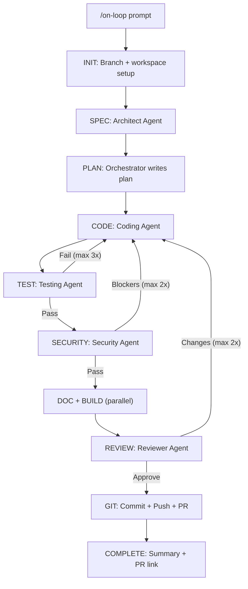

# On-Loop

Spec-driven SDLC plugin for [Claude Code](https://docs.anthropic.com/en/docs/claude-code) that orchestrates specialist agents through a full development lifecycle with security-first engineering practices.

## What It Does

`/on-loop` takes a prompt and runs it through a complete software development pipeline:

```
Prompt → Branch → Spec → Plan → Code → Test → Security → Docs + Build → Review → Commit + Push + PR → Done
```

Each phase is handled by a specialist agent operating as a Staff Engineer with ISC2 certifications, building for regulated financial environments and critical infrastructure.

## Installation

### Option 1: Marketplace (recommended)

Add the on-loop marketplace, then install the plugin:

```
/plugin marketplace add joestein/on-loop
```

This registers the marketplace from the repo's `marketplace.json`. Then install the plugin:

```
/plugin install on-loop
```

That's it — all `/on-loop` commands are now available in your Claude Code sessions.

> **How it works**: The `marketplace.json` at the repo root declares available plugins. When you run `/plugin marketplace add`, Claude Code fetches this manifest and makes the listed plugins available for install. `/plugin install` then activates the plugin, loading its commands, agents, skills, and hooks.

### Option 2: Clone to plugins directory

```bash
git clone https://github.com/your-org/on-loop.git ~/.claude/plugins/on-loop
```

### Option 3: Symlink

```bash
git clone https://github.com/your-org/on-loop.git ~/dev/on-loop
ln -s ~/dev/on-loop ~/.claude/plugins/on-loop
```

### Option 4: Project-local

Clone or copy into your project and reference it in your project's Claude Code configuration.

## Commands

| Command | Description |
|---------|-------------|
| `/on-loop <prompt>` | Run full SDLC loop with all agents |
| `/on-loop-status` | Check progress of current loop |
| `/on-loop-resume [--from=phase]` | Resume an interrupted loop |
| `/on-loop:clear` | Clean up workspace, switch to main, pull latest |
| `/on-loop:main-resolve` | Pull main, merge into branch, resolve conflicts |
| `/on-spec <description>` | Standalone spec generation |
| `/on-test <target>` | Standalone test generation |
| `/on-security <target>` | Standalone security audit |
| `/on-doc <target>` | Standalone documentation generation |
| `/on-build <target>` | Standalone build/CI setup |
| `/on-review <target>` | Standalone code review |

## Agents

| Agent | Model | Role |
|-------|-------|------|
| Orchestrator | Opus | Pipeline control, quality gates, retry logic |
| Architect | Opus | Spec generation, ADRs, system design |
| Coding | Opus | Implementation with security-first practices |
| Testing | Sonnet | Unit, integration, and E2E tests |
| Security | Opus | OWASP/STRIDE audit, compliance checks (read-only) |
| Documentation | Sonnet | READMEs, guides, CLAUDE.md files |
| Build | Sonnet | Makefile, GitHub Actions, lint/security configs |
| Reviewer | Opus | Final code review gate (read-only) |

## Architecture



### Inter-Agent Communication

Agents communicate through the `.on-loop/` workspace directory (gitignored):

- `state.json` — Phase tracking (only orchestrator writes)
- `plan.md` — Implementation plan (all agents read)
- `changes.log` — Append-only file modification log
- `agent-notes/<agent>.md` — Structured output per agent

### Quality Gates

Each phase transition is validated:

| Transition | Key Criteria |
|-----------|--------------|
| CODE → TEST | Code compiles, no self-reported critical issues |
| TEST → SECURITY | All tests pass |
| SECURITY → DOC/BUILD | No critical/high security findings |
| REVIEW → GIT | Reviewer approves |
| GIT → COMPLETE | Commit, push, PR created |

Failed gates trigger retries (TEST→CODE: 3x, SECURITY→CODE: 2x, REVIEW→CODE: 2x). After exhaustion, issues are recorded as TODOs and the pipeline continues.

## Agent Persona

All agents operate as **Staff Software Engineers** with ISC2 certifications (CISSP, CCSP, CSSLP, ISSAP, ISSEP, ISSMP) targeting:

- Regulated financial services (banking, trading, insurance)
- Critical infrastructure
- Multi-tenant SaaS

Security principles: zero trust, defense in depth, least privilege, fail secure, secure by default.

Compliance awareness: SOC2, PCI-DSS, NIST 800-53, ISO 27001, GDPR.

## Example Usage

### Full SDLC Loop

```
/on-loop Create a REST API for user management with JWT authentication, role-based access control, and PostgreSQL storage
```

### Standalone Commands

```
/on-security src/auth/           # Audit auth module
/on-test src/api/handlers.ts     # Generate tests for handlers
/on-doc                          # Document the entire project
/on-review                       # Review all uncommitted changes
```

### Resume After Interruption

```
/on-loop-status                  # Check where it stopped
/on-loop-resume                  # Resume from last phase
/on-loop-resume --from=TEST      # Resume from a specific phase
```

## Project Structure

```
on-loop/
├── .claude-plugin/plugin.json   # Plugin metadata
├── hooks/hooks.json             # Stop + PostToolUse hooks
├── marketplace.json            # Marketplace manifest
├── commands/                    # 11 user-invocable commands
├── agents/                      # 8 specialist agent definitions
├── skills/                      # Loop state + quality gate skills
├── shared/                      # Shared persona, protocols, standards
├── CLAUDE.md                    # Plugin instructions
├── README.md                    # This file
└── LICENSE                      # Apache 2.0
```

## License

Apache 2.0 — see [LICENSE](LICENSE).
