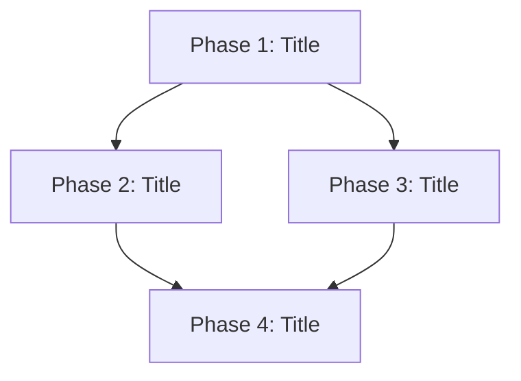

# /on-prepare

Takes a complete prompt and produces a roadmap document with phases, steps, acceptance criteria, and mermaid diagrams. Also creates the corresponding state file for tracking.

## Usage

```
/on-prepare <full prompt describing the feature to build>
```

This command is NOT interactive. It takes the entire prompt at once and produces the roadmap. No back-and-forth questions.

## Instructions

When this command is invoked:

### 1. Parse the Prompt

Read the user's argument as the complete feature description. If it is a file path, read the file contents as the prompt.

### 2. Analyze the Codebase

Before writing the roadmap:
- Read the project's `CLAUDE.md`, `README.md`, and any existing documentation
- Survey the directory structure with Glob to understand the codebase layout
- Read key source files to understand the technology stack, patterns, and conventions
- Check for existing roadmaps in `roadmap/` to avoid duplication

### 3. Slugify the Feature Name

Generate a slug from the feature title:
1. Lowercase the title
2. Replace spaces and special characters with hyphens
3. Collapse multiple hyphens into one
4. Trim leading/trailing hyphens
5. Truncate to 50 characters

### 4. Create the Roadmap Document

Write `roadmap/<feature-slug>.md` with this structure:

```markdown
# <Feature Title> -- Roadmap

## Vision
One paragraph on what this feature does and why it matters.

## Architecture


Describe the high-level architecture and how phases relate. Include dependency edges between phases.

## Phases

### Phase 1: <Title>
- **Status**: not-started
- **Branch**: feature/<slug>-phase-1
- **Depends on**: (none)
- **Steps**:
  1. [ ] Step description `parallel: true`
     - Files: `path/to/file1`, `path/to/file2`
  2. [ ] Step description `exclusive: true`
     - Files: `path/to/file3`
  3. [ ] Step description `conflicts_with: [1]`
     - Files: `path/to/file1`, `path/to/file4`
- **Acceptance criteria**:
  - [ ] Criterion 1
  - [ ] Criterion 2

### Phase 2: <Title>
...
```

#### Roadmap Guidelines

- **Phases** represent major milestones that may have dependencies between them
- **Steps** within a phase are the units of work that `/on-continue` picks up
- Each step should be completable in a single agent pipeline execution (30-60 min of work)
- Tag each step with parallelism annotations:
  - `parallel: true` -- Safe to run concurrently with other parallel steps
  - `exclusive: true` -- Must not run while any other step in the phase is active
  - `conflicts_with: [N, M]` -- Cannot run while steps N or M are active
- List the files each step will create or modify (for file-level conflict detection)
- Write acceptance criteria that are specific and testable
- Use mermaid diagrams to show phase dependencies and architecture

### 5. Create the State File

Create `roadmap/.state/<feature-slug>.json` following the schema in `skills/roadmap-state/SKILL.md`:

1. Set `version` to `"1.0"`
2. Set `feature` to the slug
3. Set `feature_title` to the human-readable title
4. Set `roadmap_file` to `roadmap/<feature-slug>.md`
5. Set `created_at` and `updated_at` to current ISO 8601 timestamp
6. Set `current_phase` to 1
7. Set `total_phases` to the number of phases
8. For each phase, create an entry with:
   - `title`: phase title
   - `status`: `"not-started"`
   - `branch`: `"feature/<slug>-phase-<N>"`
   - `depends_on`: list of phase numbers this depends on
   - `started_at`: null
   - `completed_at`: null
   - `steps`: object with numbered step entries, each having:
     - `title`: step description
     - `status`: `"not-started"`
     - `parallel`, `exclusive`, `conflicts_with`: from the roadmap annotations
     - `files`: list of file paths from the roadmap
     - `assigned_session`: null
     - `started_at`: null
     - `completed_at`: null
   - `steps_total`: count of steps
   - `steps_completed`: 0
9. Set `locks` to empty object
10. Set `sessions` to empty object
11. Set `last_activity` to current timestamp

### 6. Ensure Global Lock File Exists

If `roadmap/.state/_global.json` does not exist, create it:

```json
{
  "version": "1.0",
  "migration_lock": null,
  "active_sessions": {}
}
```

### 7. Ensure Directories Exist

Create `roadmap/` and `roadmap/.state/` directories if they do not exist.

### 8. Report

Display to the user:
- The roadmap file path
- The state file path
- Number of phases and total steps
- A summary of the phase dependency graph
- Suggest running `/on-plan` next to generate the detailed implementation plan

## Important

- This command does NOT run the agent pipeline. It only produces the roadmap and state.
- The roadmap is committed to the repo (not ephemeral).
- The prompt is consumed in full -- no follow-up questions.
- If a roadmap already exists for this slug, warn the user and ask before overwriting.
- Each step should be scoped small enough for one `/on-continue` execution.
