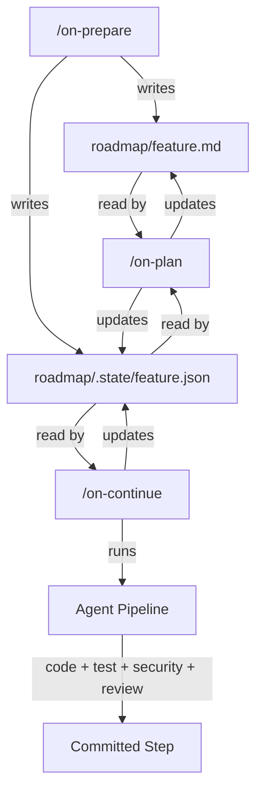
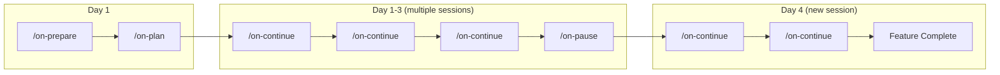

# Prepare, Plan, Continue: Multi-Session Roadmap Development for Claude Code

**TL;DR** -- On-loop v0.2.0 adds three new commands that turn Claude Code into a multi-session, multi-person development workflow. `/on-prepare` generates a roadmap from your prompt. `/on-plan` turns it into parallelism-annotated steps. `/on-continue` picks up the next available step and builds it -- and three people can run it at the same time on the same repo without stepping on each other.

---

## The Problem With Long-Running Features

The original `/on-loop` command is great for single-shot features: one prompt, one PR. But real features -- the kind that take days or weeks -- don't fit in a single session. You need to:

- Break work into phases and steps
- Track what's done across sessions
- Let multiple people (or multiple Claude Code windows) work in parallel
- Resume exactly where you left off

Until now, that meant re-explaining context every session and manually coordinating who's touching what files.

## Three New Commands

### `/on-prepare` -- From Prompt to Roadmap

Give it a full description of what you want to build. It analyzes your codebase, breaks the work into phases with dependency graphs, and writes a structured roadmap with mermaid diagrams.

```
/on-prepare "Build a Monte Carlo simulation engine that runs pitcher
matchup simulations using historical stats, generates probability
distributions, and displays results in a real-time dashboard"
```

This produces two files committed to your repo:

- `roadmap/monte-carlo.md` -- Human-readable roadmap with phases, steps, acceptance criteria, and architecture diagrams
- `roadmap/.state/monte-carlo.json` -- Machine-readable state tracking

The roadmap isn't ephemeral. It lives in your repo so anyone on the team can read it.



### `/on-plan` -- Parallelism-Annotated Implementation Plan

Reads the roadmap, analyzes your codebase, and produces a detailed implementation plan for the current phase. The key innovation: every step is annotated with parallelism metadata.

```
/on-plan monte-carlo
```

Each step gets tagged:

- **`parallel: true`** -- Safe to run concurrently with other parallel steps
- **`exclusive: true`** -- Must not run while any other step is active
- **`conflicts_with: [1, 3]`** -- Cannot run at the same time as steps 1 or 3

This metadata is what makes multi-session work possible. When three sessions run `/on-continue`, each one knows which steps are safe to pick up.

### `/on-continue` -- The Workhorse

This is where the work happens. Run it, and it:

1. Reads the state file
2. Finds the next unclaimed, non-conflicting step
3. Acquires a file-level lock
4. Runs the full agent pipeline (code, test, security, review)
5. Commits the completed step
6. Releases the lock

```
/on-continue monte-carlo
```

That's it. No prompt needed. It knows what to do from the plan.

#### Three People, One Repo

```
Session A: /on-continue monte-carlo
  -> picks step 1 (parallel: true) -> locks it -> builds it -> commits -> done

Session B: /on-continue monte-carlo
  -> step 1 locked -> picks step 2 (parallel: true) -> locks it -> builds it -> commits

Session C: /on-continue monte-carlo
  -> step 1 locked, step 2 locked -> picks step 3 -> locks it -> builds it

Session A: /on-continue monte-carlo
  -> step 1 done, step 2 in-progress, step 3 in-progress -> picks step 4 -> ...
```

Each session runs `/on-continue` repeatedly. Each time, it picks up the next available step. When all steps in a phase are done, the phase is marked complete and work advances to the next one.

### `/on-pause` -- Clean Handoff

When you need to stop:

```
/on-pause monte-carlo
```

This releases all your locks, commits any WIP, writes a handoff summary to `roadmap/.state/monte-carlo-handoff.md`, and cleans up your session. The next person (or your next session) gets a clear picture of where things stand.

---

## File-Based Locking

Multi-session coordination uses file-level locks stored in the state JSON. No external services, no databases -- just files in the repo.

```json
{
  "locks": {
    "src/simulation/engine.py": {
      "session": "session-abc123",
      "phase": 2,
      "step": 3,
      "acquired_at": "2026-04-05T14:30:00Z",
      "ttl_minutes": 60
    }
  }
}
```

Locks expire after 60 minutes with no heartbeat (updated every 5 minutes during active work). If a session dies without running `/on-pause`, the locks eventually expire and the step becomes available for retry.

A global coordination file at `roadmap/.state/_global.json` tracks active sessions across features, preventing conflicts like two sessions trying to create database migrations simultaneously.

---

## The Full Workflow



1. **Day 1**: `/on-prepare` with your feature description. Review the roadmap. `/on-plan` to detail the first phase.
2. **Days 1-3**: Run `/on-continue` repeatedly. Each invocation builds one step. Multiple people can run it simultaneously. Use `/on-pause` when stopping for the day.
3. **Day 4+**: `/on-continue` picks up right where you left off. No re-explaining. No context loss.

---

## What's Different From `/on-loop`

| | `/on-loop` | `/on-prepare` + `/on-plan` + `/on-continue` |
|---|---|---|
| **Input** | Single prompt | Roadmap with phases and steps |
| **Scope** | One feature, one PR | Multi-phase features over days/weeks |
| **Sessions** | Single session | Multiple sessions, multiple people |
| **State** | Ephemeral `.on-loop/` | Persistent `roadmap/` in repo |
| **Parallelism** | None | File-level locking with conflict detection |
| **Resume** | `/on-loop-resume` (same session) | `/on-continue` (any session) |

`/on-loop` is still the right choice for features that fit in one shot. The new commands are for everything else.

---

## Install On-Loop

On-loop is an open-source Claude Code plugin. Get it at [github.com/joestein/on-loop](https://github.com/joestein/on-loop).

### From the Plugin Marketplace

```
/plugin marketplace add git@github.com:joestein/plugin-testing.git
/plugin install on-loop
```

### From Source

```bash
git clone https://github.com/joestein/on-loop.git ~/.claude/plugins/on-loop
```

Once installed, you have access to all on-loop commands: `/on-loop`, `/on-prepare`, `/on-plan`, `/on-continue`, `/on-pause`, and the standalone agent commands (`/on-spec`, `/on-test`, `/on-security`, `/on-doc`, `/on-build`, `/on-review`).

---

## What's Next

The roadmap commands are infrastructure for bigger things. Next up:

- **Backend agent system** -- Long-running async agents (like Monte Carlo simulations) that survive beyond a single request, report progress in real-time, and can be scheduled
- **Frontend agent dashboard** -- A UI for monitoring agent runs, viewing step logs, and managing schedules
- **Monte Carlo simulation** -- The first feature built entirely through the prepare/plan/continue workflow

The tools to build complex features are here. Now we build the features.

---

*On-loop is open source under Apache 2.0. Source: [github.com/joestein/on-loop](https://github.com/joestein/on-loop)*
